<h1 align=center>
Le Centre des sciences de Montréal 
</h1>

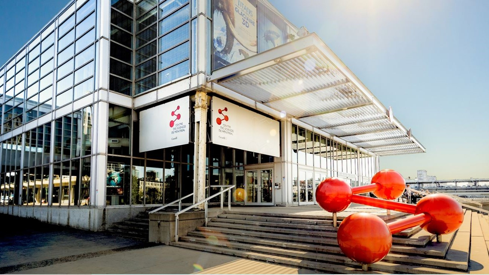

Adresse : <strong>2 R. de la Commune O, Montréal, QC H2Y 4B2</strong> 
Durée : <strong>30 minutes</strong> 
Présenté: <strong>Le 5 avril 2024</strong> 
Installation: <strong>Permanente</strong>

<h1 align=center>Description de l'installation</h1>
<h3 align=center>L'exposition temporaire et immersive de Samuel Tétreault, "RIOPELLE Grandeur Nature", clôture de manière remarquable les célébrations du centenaire de Jean Paul Riopelle. En utilisant des technologies de pointe telles que la projection vidéo à 360° et la spatialisation sonore, elle transporte les visiteurs au cœur de l'œuvre de l'artiste et des paysages qui ont nourri son inspiration. De l'atelier de Riopelle aux paysages qui l'ont inspiré, en passant par ses œuvres les plus marquantes ainsi que celles moins connues, cette exposition offre une immersion totale dans l'univers créatif de Riopelle.</h3>

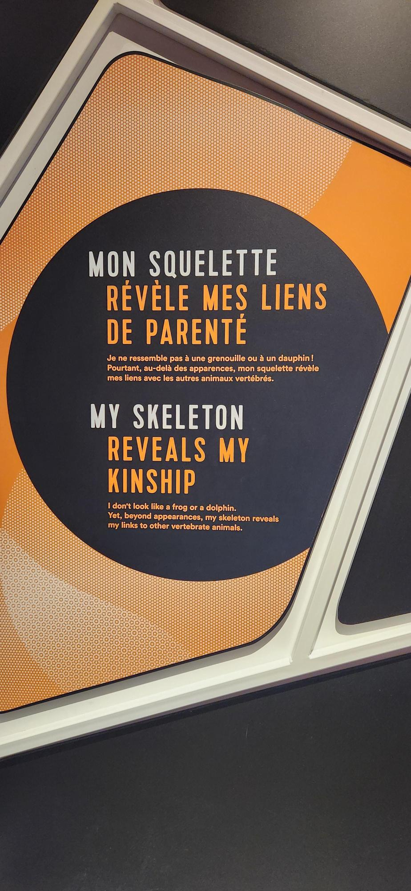</h4>

 

<h3 align=center>Mise en espace</h3>
 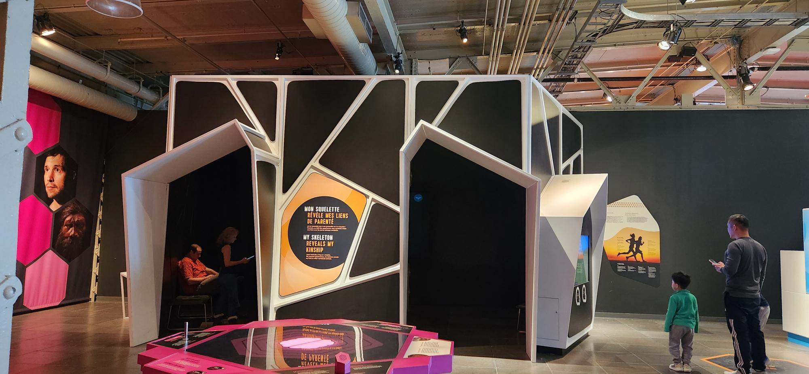 
À l'entrée, les visiteurs sont accueillis par un bureau de réception situé sur la gauche, où un code QR est disponible, fournissant diverses informations sur l'exposition. Cette zone s'intègre harmonieusement avec l'exposition principale, où sont présentées les toiles, sculptures et interactions artistiques. Un escalier conduit également au sous-sol, abritant la section consacrée aux Inuits et une salle de présentation vidéo sur la vie de Riopelle. Dans cette salle, six grands écrans sont disposés sur chaque mur rectangulaire, diffusant le son à travers des haut-parleurs positionnés au plafond. L'absence apparente de fils électriques crée une atmosphère aérée et spacieuse. Au centre de la salle se trouve un podium orné d'oiseaux en papier et de branches, évoquant un nid. Des brins d'herbe artificiels bordent la salle sous les écrans, ajoutant une touche finale à l'ambiance générale.
 
 

| Salle de projection | L'installation de la salle | 
| :---: | :---: | 
| 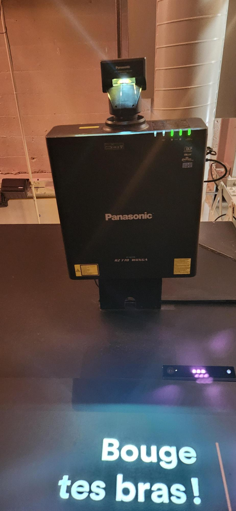</h4> | 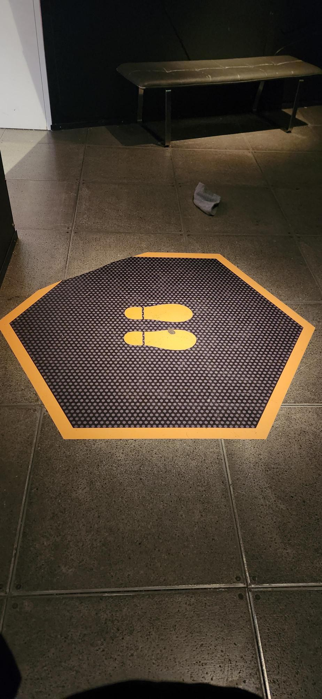</h4> |

| Salle de projection | L'installation de la salle | 
| :---: | :---: | 
| 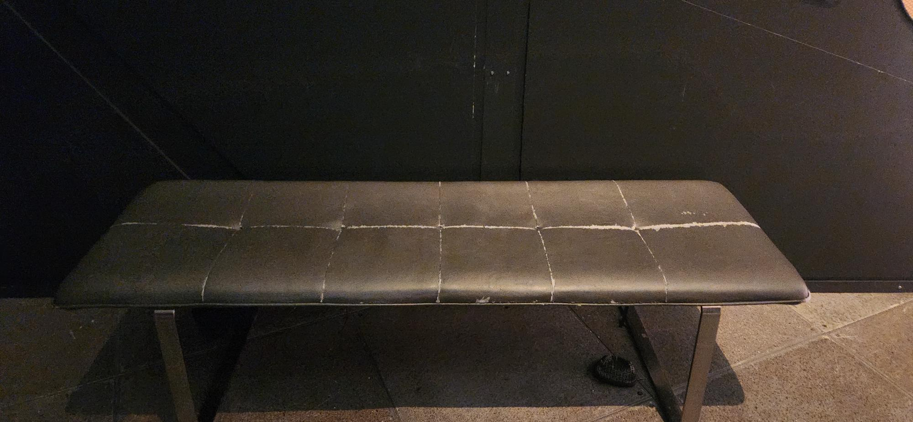</h4> | </h4> |
  
<h3 align=center>Composantes et techniques</h3>

- Plans de l'installation
- Plans du matériel requis obligatoirement
- Six écrans
- Six projecteurs
- Six grands haut-parleurs
- Six petits haut-parleurs
- Une grande plateforme
- Trois petites plateformes qui répliques des troncs d'arbre
- Quelques oiseaux en papier
- Plusieurs fausses plantes
- Plusieurs branches de bois
- Plusieurs chaises en bois
- Grands rideaux noirs
- Fils transparents assez forts pour soutenir les écrans
- Caissons de basses-fréquences

<h3 align=center>Éléments nécessaires à la mise en exposition</h3>

- Plans de l'installation
- Plans du matériel requis obligatoirement
- Six écrans
- Six projecteurs
- Six grands haut-parleurs
- Six petits haut-parleurs
- Une grande plateforme
- Trois petites plateformes qui répliques des troncs d'arbre
- Quelques oiseaux en papier
- Plusieurs fausses plantes
- Plusieurs branches de bois
- Plusieurs chaises en bois
- Grands rideaux noirs
- Fils transparents assez forts pour soutenir les écrans
- Caissons de basses-fréquences

<h3 align=center>Expérience vécue</h3>
<strong>Le 1er mars 2024</strong>, 
 
 
 

| Sculpture | Allure sophistiquée | 
| :---: | :---: | 
| 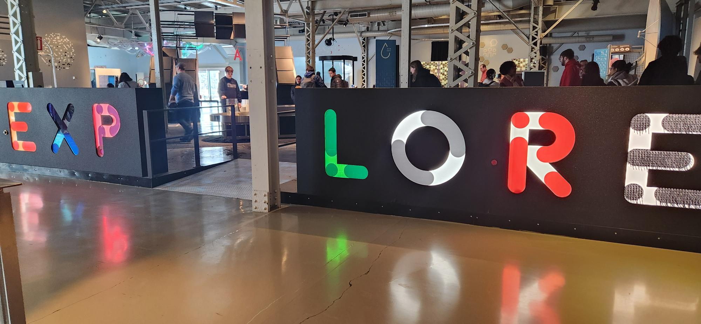</h4> | 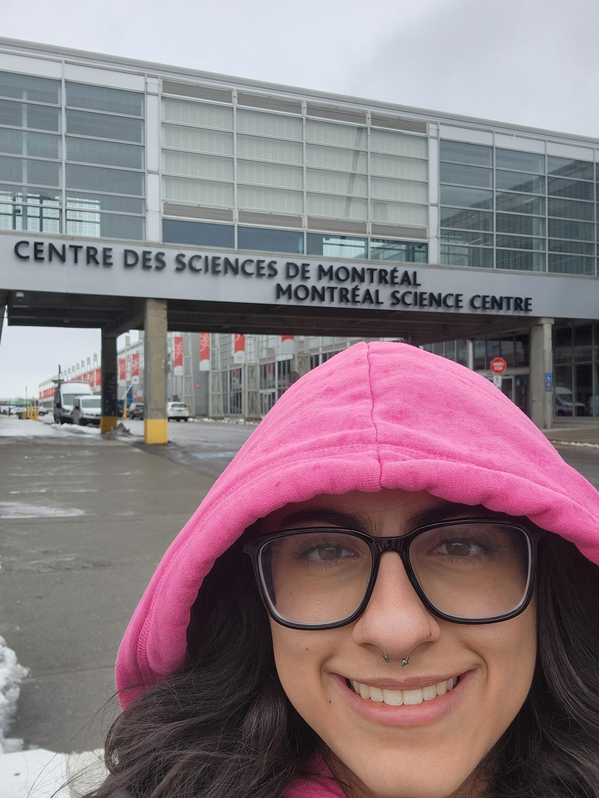</h4> |

  
<h3 align=center>Aspects que je ferais autrement</h3>

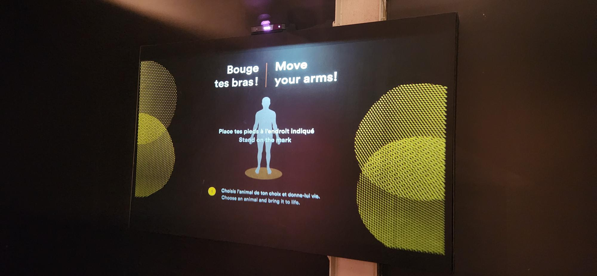

<h3 align=center>Ce qui m'a plu</h3>

 
 

| Sculpture | Allure sophistiquée | 
| :---: | :---: | 
| 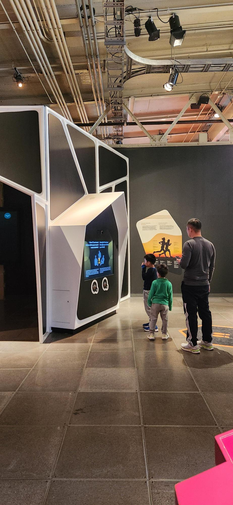</h4> | 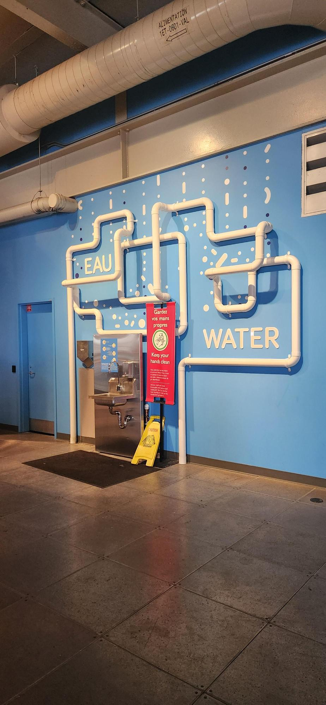</h4> |
| Sous-sol | Moi devant le Studio des 7 Doigts | 
| 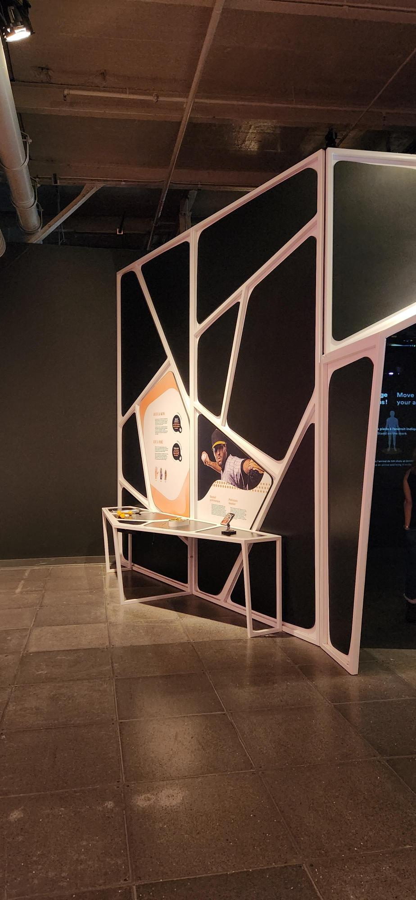</h4> | 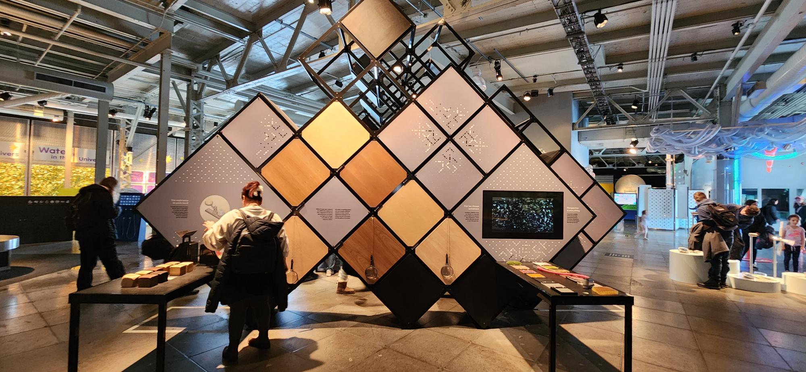</h4> |

<strong>
  Toutes les informations mentionnées ont été extraites du document accessible via le code QR à l'entrée, situé dans la section "Médias", ainsi que des fiches des œuvres, du site web de l'exposition, ou encore de mes propres observations personnelles.
</strong>
 
 
Pour obtenir plus d'informations, veuillez consulter les fiches des œuvres exposées disponibles dans la section "Médias", ou cliquez ici.
 
<h4 align=center>(https://tohu.ca/fr/programmation/riopelle-grandeur-nature)  
<h4 align=center>ou  
<h4 align=center>(https://7doigts.com/spectacles/creations/riopelle-grandeur-nature-spectacle)
 
