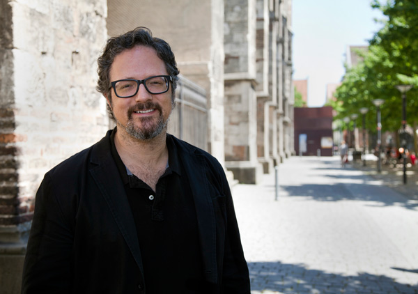

<h1 align=center>CONFÉRENCE</h1>
<h2 align=center>Présentée par Jade Séguela, en tant que registraire, au sein du Studio Antimodular dirigé par Rafael Lozano-Hemmer
</h2>
<h1 align=center>
 
  </h1>

Lieu de mise en exposition: <strong> Salle Claude Legault (B1346) du Collège Montmorency </strong> 
Adresse : <strong>475 Bd de l'Avenir, Laval, QC H7N 5H9</strong> 
Durée : <strong>1h30</strong> 
Présenté: <strong>Mardi 16 avril 2024</strong>

<h2 align=center>Studio Antimodular</h2>
Antimodular Inc. est un studio de recherche dirigé par l'artiste Rafael Lozano-Hemmer, établi à Montréal depuis 2003. Avec une équipe de 15 employés à temps plein et des collaborateurs internationaux, le studio crée des projets novateurs dans le monde entier, présentés dans des biennales d'art majeures et des collections de musées renommés.

<h2 align=center>Rafael Lozano-Hemmer</h2>
<h1 align=center>
 
</h1>
Rafael Lozano-Hemmer est un artiste né à Mexico en 1967. Il est également le fondateur et directeur du Studio Antimodular, basé à Montréal. Il travaille à l'intersection de l'architecture et de l'art performance, créant des installations publiques interactives utilisant diverses technologies telles que des lumières robotiques et des réseaux télématiques. Son travail a été exposé dans des biennales et des musées renommés à travers le monde, et il a reçu de nombreux prix prestigieux. 

<h2 align=center>Présentation Jade Séguela</h2>
Jade assume plusieurs responsabilités cruciales au sein du Studio Antimodular. En tant que registraire, elle supervise les opérations d'exportation et d'importation, gérant ainsi les envois à l'international. Elle est également chargée de la logistique, organisant l'emballage des œuvres dans des caisses qu'elle conçoit elle-même. Assurant la conservation des œuvres, Jade s'engage à vérifier leur état avant et après le transport. Elle tient à jour la documentation des œuvres, établissant ainsi un inventaire complet de tous les éléments nécessaires à leur mise en place. Enfin, elle prend en charge la gestion de l'entrepôt et l'installation des œuvres, assurant ainsi un fonctionnement efficace de l'espace.
 
 
Pour être en mesure d'accomplir toutes ces tâches, elle a fait:
 
 

- DEC Arts et Lettres
- Bachelor of Fine Arts
- Maîtrise en Muséologie

<h2 align=center>Thème de sa conférence</h2>
<strong>En premier lieux, elle nous a parlée de l'intéractivité passive ou active:</strong> 
Dans l'ensemble, l'interactivité passive englobe des œuvres qui invitent les gens à observer, marcher et respirer, tandis que l'interactivité active implique l'utilisation de la parole et l'interaction avec des boutons, entre autres.
 
 
<strong>Étude de cas #1:</strong> 
Dans un second temps, elle nous a expliqué comment elle documente une exposition d'art numérique et son importance cruciale. La documentation joue un rôle essentiel pour l'équipe, car elle permet de connaître le contenu précis de chaque œuvre ainsi que leur emplacement dans les caisses, évitant ainsi des ouvertures inutiles et assurant le bon déroulement de l'exposition. De plus, cette documentation offre une protection contre les dommages et les pertes éventuelles, tout en facilitant les formalités douanières en justifiant le contenu des caisses. En outre, elle constitue une archive essentielle pour l'historique des œuvres, prévenant ainsi toute répétition des étapes et permettant de gagner du temps lors de la mise en place.
 
<strong>Étude de cas #2:</strong> 
Ensuite, elle nous a parlé de la production de l'œuvre intitulée "Translation Stream" sur une île déserte, plus précisément sur l'île Lulu, située à Abou Dabi. Les défis liés à cet emplacement étaient nombreux. Tout d'abord, les problèmes de corrosion dus à l'humidité ont été une préoccupation majeure, aggravés par une pluie imprévue qui a endommagé considérablement le matériel, nécessitant l'utilisation de sacs poubelles comme solution temporaire. De plus, l'absence d'électricité sur l'île a contraint l'équipe à recourir à des dispositifs alimentés par l'énergie solaire et à explorer d'autres alternatives. Ils ont également dû faire face aux défis posés par le sable, qui a engendré de nouveaux problèmes techniques nécessitant des solutions improvisées sur place. Tout cela a été entrepris avec un souci constant de ne pas perturber l'écosystème fragile de l'île, habituellement dépourvue de présence humaine.
  
<strong>Bonus:</strong>
Pour finir, elle nous a mis au courant que le studio a un github qui est libre d'acces et même qu'il nous encourage à essayer de reproduire leur oeuvre. 
Voici le lien: (lien)

<h2 align=center>Mon appréciation de la conférence</h2>

Je dois avouer que j'ai été très impressionnée par cette conférence. Elle m'a vraiment surprise par la pertinence de son contenu, notamment en révélant l'étendue des responsabilités d'une registraire dans un projet d'une telle envergure. Les péripéties rencontrées lors de la réalisation du projet "Translation Stream" m'ont particulièrement marquée, et leur réussite finale malgré ces obstacles m'a véritablement impressionnée.

 

<strong>
Les informations sont obtenues à la fois de la conférence et de mes propres observations, ainsi que du lien suivant :
 
(https://www.lozano-hemmer.com/)  
  ou 
(https://www.instagram.com/lozanohemmer/?hl=fr) 
  ou 
(https://www.cgarchitect.com/companies/62ba3399-antimodular-inc)

