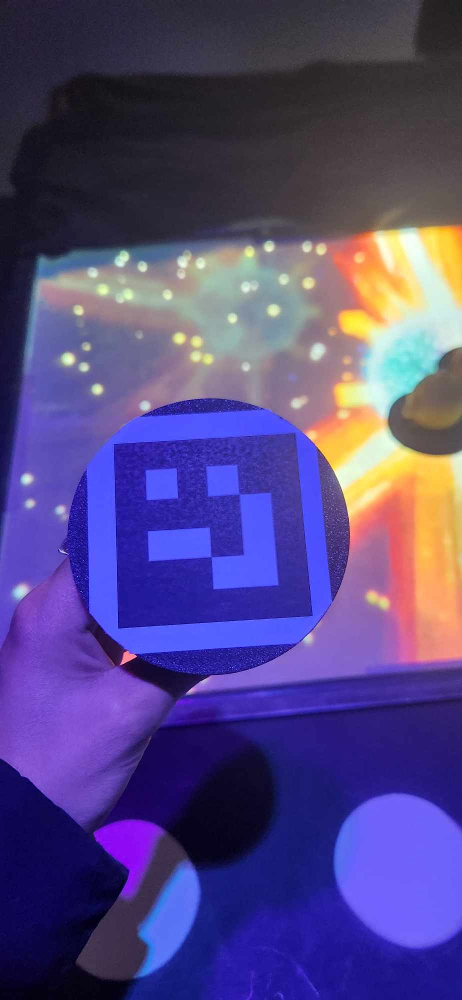
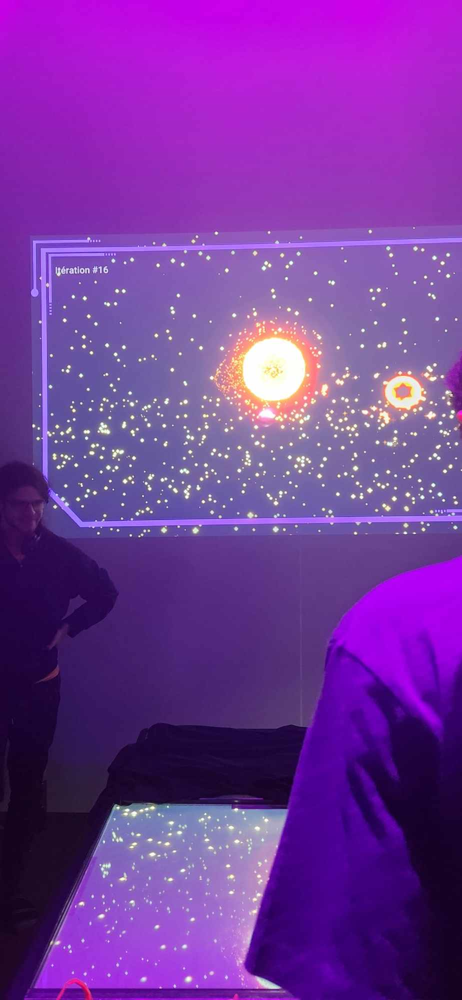
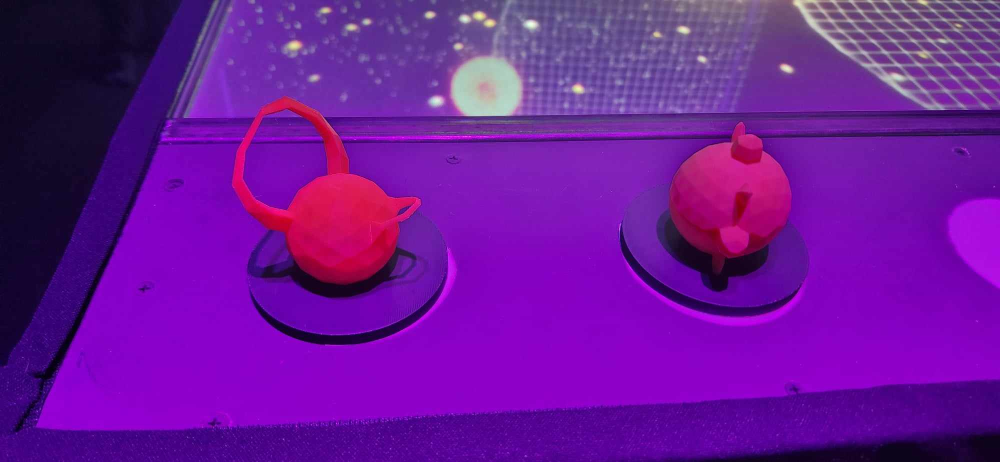
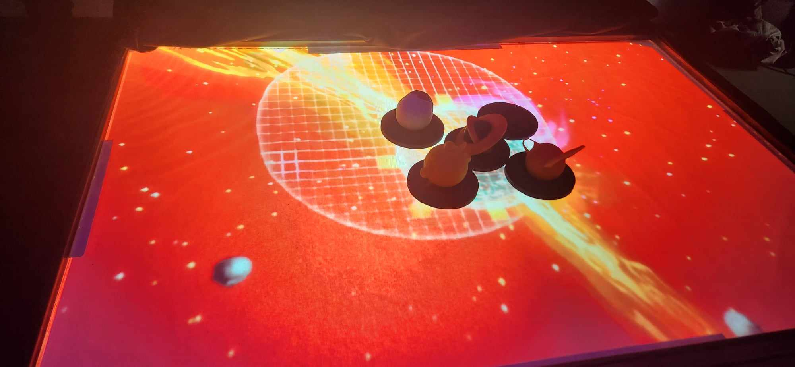

<h1 align=center>
Canevas Cosmique</h1>

<h2 align=center>Une œuvre artistique développée par Jacob Alarie-Brousseau, Étienne Charron, Jérémy Cholette, Quoc Huy Do et Mikaël Tourangeau en collaboration avec le Collège Montmorency
  
 Présenté: <strong>18.03.2024 - 21.03.2024</strong>
</h2>
<h4 align=center>
 
</h4>

<h3 align=center>Lien avec le thème Crescentia</h3>

<h4 align=center>
Canevas Cosmique s'intègre parfaitement au projet Crescentia en proposant un développement du système solaire contrôlé par l'utilisateur à l'aide de petites statuettes placées sur la table.
</h4>
 

 <h3 align=center> L'installation en cours</h3>
 
| Code QR | Projection | 
| :---: | :---: | 
| </h4> | </h4> |
| Statuettes | Table | 
| </h4> | </h4> |

<h3 align=center>Schéma de l'installation</h3>

| Page 1 | Page 2 | 
| :---: | :---: | 
| </h4> | </h4> |
  

<h3 align=center>Expérience vécue</h3>
En essayant "Canevas Cosmique", je suis fascinée par l'originalité du projet de l'équipe. Les explosions sonores ajoutent à l'immersion dans cet univers où je me sens presque comme un dieu de la destruction. La découverte du code QR sous les figurines attire mon attention, laissant présager son importance. Cela me pousse à envisager une modification : protéger ce code QR avec une fine couche de plastique transparent. Cette précaution paraît essentielle pour préserver son intégrité face aux manipulations des figurines. Cette expérience m'a également ouvert de nouvelles perspectives créatives auxquelles je n'avais pas songé auparavant.

<h3 align=center>3 cours du programme incontournables pour ce projet</h3>

- Conception d’une expérience multimédia
- Web 5
- Objets interactifs

<h3 align=center>Technique ou composante technologique que je ne connaissais pas</h3>
<h5 align=center>Je n'avais aucune idée qu'il était possible d'utiliser des codes QR pour interagir de cette manière.</h5>

<strong>
Les informations présentées proviennent des créateurs de l'œuvre ainsi que de leurs ressources accessibles sur GitHub, ou bien de mes propres observations personnelles.
</strong>
 
 

Pour consulter plus de détails, veuillez cliquer sur ce lien : (https://tim-montmorency.com/2024/projets/Canevas-Cosmique/docs/web/index.html) 
