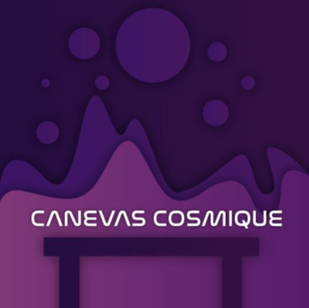

<h1 align=center>
Canevas Cosmique</h1>

<h4 align=center>Une œuvre artistique développée par Jacob Alarie-Brousseau, Étienne Charron, Jérémy Cholette, Quoc Huy Do et Mikaël Tourangeau en collaboration avec le Collège Montmorency
  
 Présenté: <strong>18.03.2024 - 21.03.2024</strong>
</h4>
<h4 align=center>
 
</h4>

<h1 align=center>Lien avec le thème Crescentia</h1>

<h3 align=center>
Canevas Cosmique s'intègre parfaitement au projet Crescentia en proposant un développement du système solaire contrôlé par l'utilisateur à l'aide de petites statuettes placées sur la table.
</h3>
 

<h3 align=center>Schéma de l'installation</h3>

<h4 align=center>
 
</h4>
 

| Salle de projection | L'installation de la salle | 
| :---: | :---: | 
| </h4> | </h4> |
  

<h3 align=center>Expérience vécue</h3>
<strong>Le 7 mars 2024</strong>, lors de ma visite au grand studio, l'œuvre "Canevas Cosmique" se dresse immédiatement devant moi dès mon arrivée. Une fois à l'intérieur, je remarque une table ornée de quelques statuettes étranges. En explorant leur manipulation, j'expérimente différentes actions qui déclenchent des explosions et des collisions surprenantes dans l'exposition. À la fin de mes essais, je découvre un code QR sous les figurines, semblant posséder une importance significative. Je trouve que cette œuvre se distingue par son concept unique, ajoutant ainsi une pertinence particulière à l'ensemble de l'exposition.
 
 
 

| Tableau du dragon | Ligne d'oiseaux | 
| :---: | :---: | 
| </h4> | </h4> |
<h4 align=center>Moi devant le Studio des 7 Doigts  
</h4>

  
<h3 align=center>Aspects que je ferais autrement</h3>

Si j'avais l'opportunité de modifier quelque chose, je choisirais de protéger le code QR situé sous les figurines avec une fine couche de plastique transparent. Cette précaution s'avérerait nécessaire car ce code semble revêtir une grande importance, et son exposition à la friction lors des manipulations des figurines pourrait entraîner sa dégradation.

<h3 align=center>Ce qui m'a plu</h3>
Ce qui m'a vraiment impressionné, c'est la façon dont cette œuvre a élargi mes horizons artistiques. Personnellement, je n'avais pas envisagé une idée aussi novatrice et stimulante. Cette expérience m'a ouvert les portes à de nouvelles perspectives créatives, m'incitant à explorer des horizons artistiques que je n'avais pas explorés auparavant.
 
 

| Sculpture | Tableau collectif | 
| :---: | :---: | 
| </h4> | </h4> |
<h4 align=center>Sous-sol
<h4 align=center></h4>
<h4 align=center>Atelier interactif  
</h4>
</h4>

<strong>
Les informations présentées proviennent des créateurs de l'œuvre ainsi que de leurs ressources accessibles sur GitHub, ou bien de mes propres observations personnelles.
</strong>
 
 

Pour consulter plus de détails, veuillez cliquer sur ce lien : (https://tim-montmorency.com/2024/projets/Canevas-Cosmique/docs/web/index.html) 
