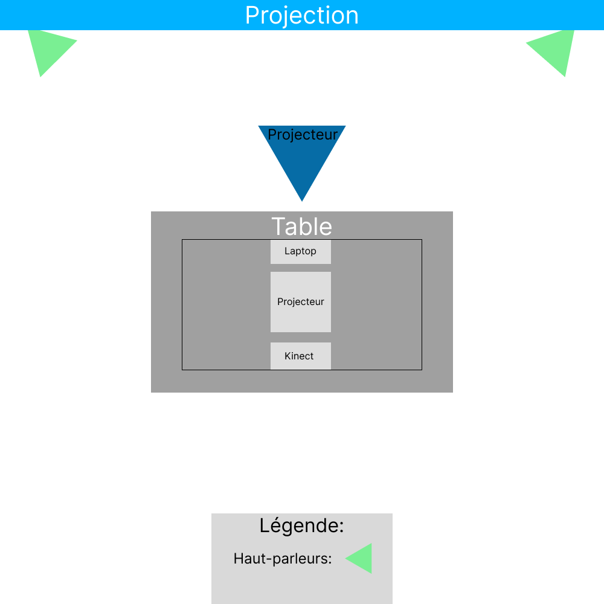

<h1 align=center>
Canevas Cosmique</h1>

<h2 align=center>Une œuvre artistique développée par Jacob Alarie-Brousseau, Étienne Charron, Jérémy Cholette, Quoc Huy Do et Mikaël Tourangeau en collaboration avec le Collège Montmorency
</h2>
<h4 align=center>
 
</h4>

<h3 align=center>Lien avec le thème Crescentia</h3>

<h4 align=center>
Canevas Cosmique s'intègre parfaitement au projet Crescentia en proposant un développement du système solaire contrôlé par l'utilisateur à l'aide de petites statuettes placées sur la table.
</h4>
 

 <h3 align=center> L'installation en cours</h3>
 <h4 align=center>Il est déjà possible de comprendre asser bien le résultat voulu puisque les figurines sur la tables bougent déjà les planetes sur la projections, malgré qu'il manque une petite touche de finition le projet semble très bien entamé.
| Code QR | Projection | 
| :---: | :---: | 
| </h4> | </h4> |
| Statuettes | Table | 
| </h4> | </h4> |

<h3 align=center>Schéma de l'installation</h3>
Pour pouvoir réaliser cette installation il va falloir : 
 
(Scénographie)
 
- Table
- Matériaux: Bois, acier, Acrylique, Spandex
(38 x 26", 31" de hauteur)
- Statuettes imprimées en 3D
- Notepad contenant les infos pour l'opération de la table
 (Lumière) 

- 1 Lumière DMX
 (Audio) 

- 2 haut-parleurs
- 5 fils XLR
- 3 conducteurs de 15' (M->F)
- 1 carte de son
 (Vidéo) 

- 1 projecteur vidéo shortrow
- 1 projo ultra short-throw
- 3 système d'acrochage
- 1 KinectV2
 (Électricité) 

- 2 cordon IEC (pour l'alimentation des haut-parleurs)
- 4 Multiprises
 (Réseau) 

- Switch poe 1 port
- Switch Ethernet 3 ports
- 7 Cables Ethernet
- 4 Cables HDMI
- 2 Receivers HDMI
- 2 Sender HDMI
 (Ordinateur) 

- 1 ordinateur
- 1 laptop
 (Logiciels requis) 

- Touch Designer
- Unity 2022.3.8f1
- Autodesk Maya
- Blender
- Reaper

| Page 1 | Page 2 | 
| :---: | :---: | 
| </h4> | </h4> |
  

<h3 align=center>Expérience vécue</h3>
En essayant "Canevas Cosmique", je suis fascinée par l'originalité du projet de l'équipe. Les explosions sonores ajoutent à l'immersion dans cet univers où je me sens presque comme un dieu de la destruction. La découverte du code QR sous les figurines attire mon attention, laissant présager son importance. Cela me pousse à envisager une modification : protéger ce code QR avec une fine couche de plastique transparent. Cette précaution paraît essentielle pour préserver son intégrité face aux manipulations des figurines. Cette expérience m'a également ouvert de nouvelles perspectives créatives auxquelles je n'avais pas songé auparavant.

<strong>
Les informations présentées proviennent des créateurs de l'œuvre ainsi que de leurs ressources accessibles sur GitHub, ou bien de mes propres observations personnelles.
</strong>
 
 

Pour consulter plus de détails, veuillez cliquer sur ce lien : (https://tim-montmorency.com/2024/projets/Canevas-Cosmique/docs/web/index.html) 
