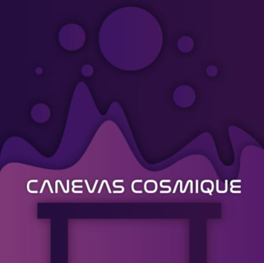
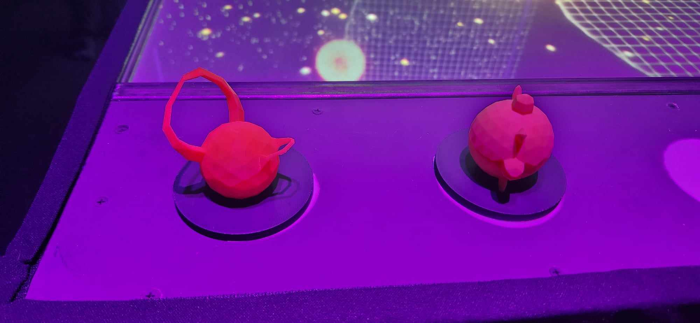

<h1 align=center>
Canevas Cosmique</h1>

<h2 align=center>Une œuvre artistique développée par Jacob Alarie-Brousseau, Étienne Charron, Jérémy Cholette, Quoc Huy Do et Mikaël Tourangeau en collaboration avec le Collège Montmorency
</h2>
<h4 align=center>
 
</h4>

<h3 align=center>Lien avec le thème Crescentia</h3>

<h4 align=center>
Canevas Cosmique s'intègre parfaitement au projet Crescentia en proposant un développement du système solaire contrôlé par l'utilisateur à l'aide de petites statuettes placées sur la table.
</h4>
 

 <h3 align=center> L'installation en cours</h3>
Il est déjà possible de se faire une bonne idée du résultat final envisagé. Les figurines disposées sur la table sont animées et influent directement sur le mouvement des planètes projetées. De plus, les conséquences des collisions entre ces éléments sont déjà visibles, ce qui permet d'appréhender une partie de l'expérience prévue. Malgré quelques ajustements mineurs restant à effectuer pour parfaire l'esthétique ou la fluidité des mouvements, l'ensemble du projet semble être sur la bonne voie et bien avancé dans sa réalisation.  
  
| Code QR | Projection | 
| :---: | :---: | 
| </h4> | </h4> |
| Statuettes | Table | 
| </h4> | </h4> |

<h3 align=center>Schéma de l'installation</h3>

| Page 1 | Page 2 | 
| :---: | :---: | 
| </h4> | </h4> |

 Pour pouvoir réaliser cette installation il va falloir : 

- Table
- Matériaux: Bois, acier, Acrylique, Spandex
(38 x 26", 31" de hauteur)
- Statuettes imprimées en 3D
- Notepad contenant les infos pour l'opération de la table
- 1 Lumière DMX
- 2 haut-parleurs
- 5 fils XLR
- 3 conducteurs de 15' (M->F)
- 1 carte de son
- 1 projecteur vidéo shortrow
- 1 projo ultra short-throw
- 3 système d'acrochage
- 1 KinectV2
- 2 cordon IEC (pour l'alimentation des haut-parleurs)
- 4 Multiprises
- Switch poe 1 port
- Switch Ethernet 3 ports
- 7 Cables Ethernet
- 4 Cables HDMI
- 2 Receivers HDMI
- 2 Sender HDMI
- 1 ordinateur
- 1 laptop
- Touch Designer
- Unity 2022.3.8f1
- Autodesk Maya
- Blender
- Reaper

<h3 align=center>Ressenti</h3>
En explorant "Canevas Cosmique", je prévois une expérience divertissante, principalement en raison de l'originalité dont il fait preuve dans sa conception. L'utilisation de figurines et de codes QR pour activer des éléments de l'installation est une approche intrigante qui suscite mon intérêt. Je suis curieuse de comprendre comment ces différents éléments sont coordonnés pour interagir entre eux et influencer l'expérience globale. Cette combinaison unique d'éléments physiques et numériques promet une expérience stimulante.

<strong>
Les informations présentées proviennent des créateurs de l'œuvre ainsi que de leurs ressources accessibles sur GitHub, ou bien de mes propres observations personnelles.
</strong>
 
 

Pour consulter plus de détails, veuillez cliquer sur ce lien : 
(https://tim-montmorency.com/2024/projets/Canevas-Cosmique/docs/web/index.html) 
