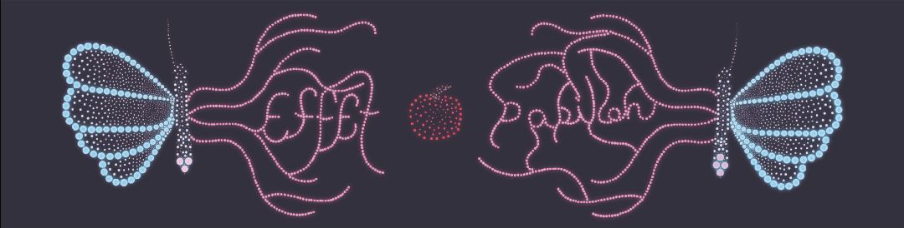
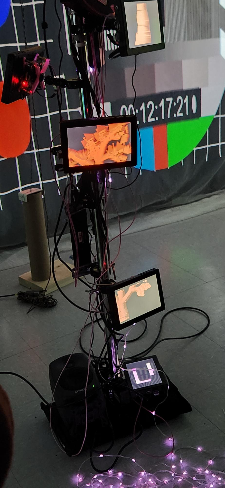
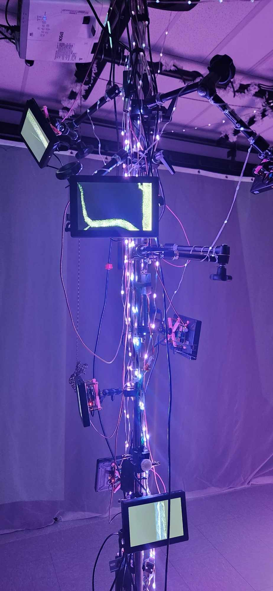
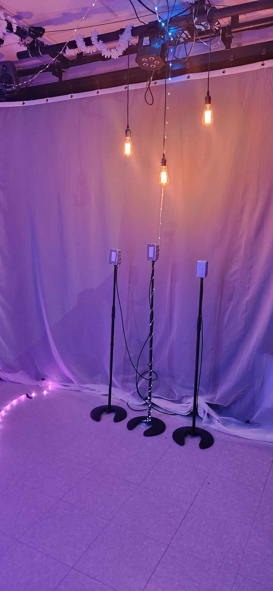
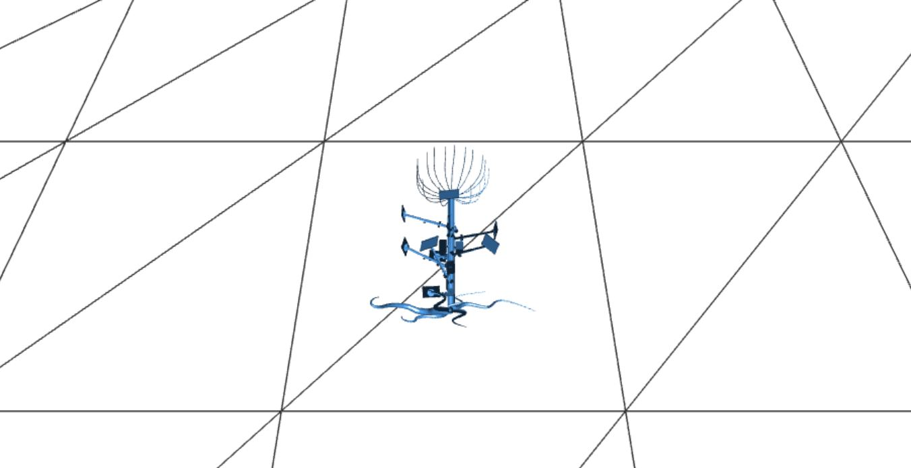

<h1 align=center>
Effet Papillon</h1>
<h2 align=center>Une œuvre artistique développée par Raphaël Dumont, Alexis Bolduc, William Morel, Alexia (Ryan) Papanikolaou, Viktor Zhuravlev et Jasmine Lapierre en collaboration avec le Collège Montmorency
</h2>

<h4 align=center>
 
</h4>

<h1 align=center>Lien avec le thème Crescentia</h1>
 
<h3 align=center>
Effet Papillon s'associe au projet Crescentia en plongeant les joueurs dans le cycle de vie d'un pommier, de sa croissance à sa maturité. À travers des éléments électroniques comme des effets visuels et sonores, le jeu illustre le concept de l'effet papillon, où de petits choix peuvent avoir de grandes conséquences. Ainsi, les interactions du joueur influencent non seulement le destin du pommier, mais aussi le déroulement global de l'aventure.
</h3>
 

 <h3 align=center> L'installation en cours</h3>
 
| Allure projet | Arbre | 
| :---: | :---: | 
| </h4> | </h4> |
<h4 align=center>Lumières  
 </h4> 

<h3 align=center>Schéma de l'installation  

</h3>

<h3 align=center>Expérience vécue</h3>
En découvrant "Effet Papillon", j'ai rapidement réalisé que mes interactions influençaient à la fois le son et les images diffusées, offrant ainsi une expérience immersive et interactive. De plus, j'ai été impressionné par l'ampleur de l'espace et le travail investi dans ce projet.
Si j'avais la possibilité de modifier quelque chose, je limiterais le nombre de personnes pouvant entrer dans la salle simultanément. À mon avis, la foule était un peu trop importante, ce qui ne permettait pas à chacun de prendre le temps d'interagir pleinement avec l'installation.
Ce qui m'a vraiment marqué, c'est la disposition et la coordination des petits écrans. Cela a permis de créer une composition visuelle remarquable et harmonieuse.

<h3 align=center>3 cours du programme incontournables pour ce projet</h3>

- Objets interactifs
- Réalité mixte
- Animation 3D

<h3 align=center>Technique ou composante technologique que je ne connaissais pas</h3>
<h5 align=center>
Je n'avais aucune idée qu'il fallait créer à la fois une entrée et une sortie pour le branchement, jusqu'à ce que j'observe attentivement le schéma de branchement. Cela m'a vraiment surpris de constater la complexité de cette exigence, car je n'avais jamais envisagé qu'une œuvre nécessiterait une telle configuration.</h5>

<strong>
Les informations présentées proviennent des créateurs de l'œuvre ainsi que de leurs ressources accessibles sur GitHub, ou bien de mes propres observations personnelles.
</strong>
 
 

Pour consulter plus de détails, veuillez cliquer sur ce lien : (https://tim-montmorency.com/2024/projets/Effet-Papillon/docs/web/index.html) 
