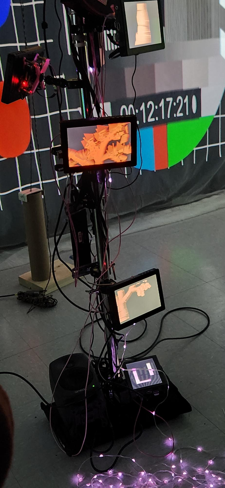
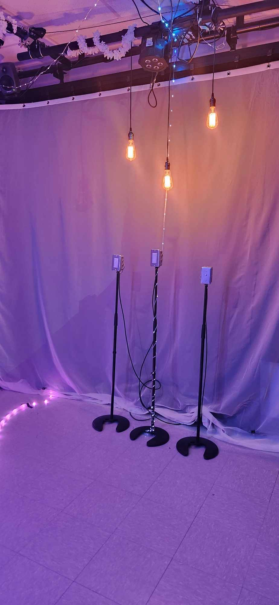

<h1 align=center>
Effet Papillon</h1>
<h2 align=center>Une œuvre artistique développée par Raphaël Dumont, Alexis Bolduc, William Morel, Alexia (Ryan) Papanikolaou, Viktor Zhuravlev et Jasmine Lapierre en collaboration avec le Collège Montmorency
</h2>

<h4 align=center>
 
</h4>

<h1 align=center>Lien avec le thème Crescentia</h1>
 
<h3 align=center>
Effet Papillon s'associe au projet Crescentia en plongeant les joueurs dans le cycle de vie d'un pommier, de sa croissance à sa maturité. À travers des éléments électroniques comme des effets visuels et sonores, le jeu illustre le concept de l'effet papillon, où de petits choix peuvent avoir de grandes conséquences. Ainsi, les interactions du joueur influencent non seulement le destin du pommier, mais aussi le déroulement global de l'aventure.
</h3>
 

 <h3 align=center> L'installation en cours</h3>
L'installation impressionne déjà par son envergure, occupant un espace considérable. Tous les éléments semblent être présents, mais plusieurs d'entre eux ne sont pas encore fonctionnels, notamment la valve, ce qui limite encore l'expérience globale de l'œuvre. Malgré cette situation, il est évident qu'un travail reste à faire sur l'aspect esthétique pour donner à l'installation sa forme finale et captivante.
  
 
| Allure projet | Arbre | 
| :---: | :---: | 
| </h4> | </h4> |
<h4 align=center>Lumières  
 </h4> 

<h3 align=center>Schéma de l'installation  

</h3>
 Pour pouvoir réaliser cette installation il va falloir : 

- Gros bouton arduino
- Atom Poe
- Hauts-parleurs
- Projecteurs
- Écran Rasberry Pi
- Valve à eau
- Écran Rasberry Pi
- Écran Rasberry Pi
- Ensemble de rails de guidage linéaire
- Écran Rasberry Pi
- Interrupteur
- Plaque interrupteur
- Ampoule LED
- Atom POE
- Écran Rasberry Pi
- Poulie
- Pomme en plastique
- Poids
- TOF
- Atom POE
- Écran Rasberry Pi
- Fairylight adressable

<h3 align=center>Ressenti</h3>
En explorant "Effet Papillon", j'anticipe déjà une multitude d'interactions fascinantes grâce aux boutons, à la valve, à la corde, et plus encore. Je suis impatiente de découvrir les résultats de ces différentes interactions, car elles semblent toutes produire des effets uniques et surprenants. Je suis convaincue que je serai impressionnée par le travail investi dans ce projet, car je peine à comprendre comment toutes ces composantes ont pu être mises en place.

<strong>
Les informations présentées proviennent des créateurs de l'œuvre ainsi que de leurs ressources accessibles sur GitHub, ou bien de mes propres observations personnelles.
</strong>
 
 

Pour consulter plus de détails, veuillez cliquer sur ce lien :  
(https://tim-montmorency.com/2024/projets/Effet-Papillon/docs/web/index.html) 
