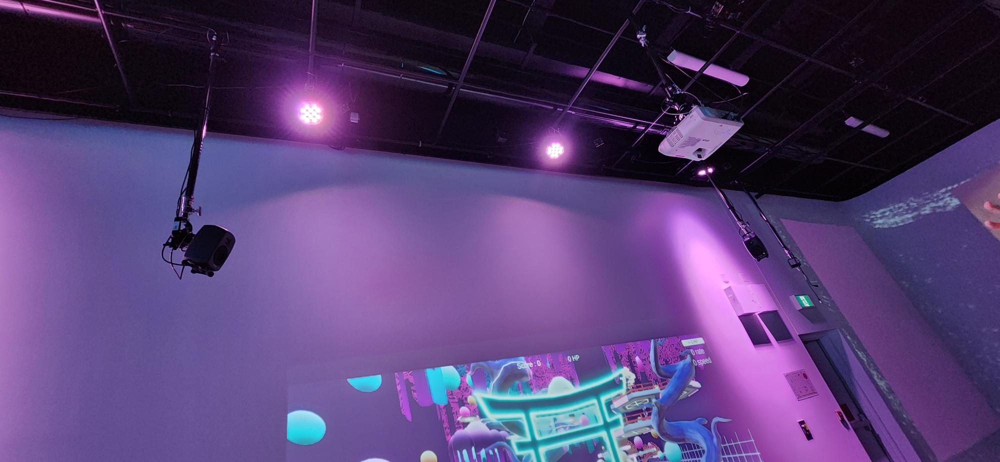

<h1 align=center>
Kigo</h1>
<h2 align=center>Une œuvre artistique développée par Érick Ouellette, William Rathier Mailly, Gabriel Clerval, Nicolas St-Martin et Antoine Dion en collaboration avec le Collège Montmorency
</h2>

  

<h2 align=center>Lien avec le thème Crescentia</h2>
<h3 align=center>
Kigo enrichit le projet Crescentia en introduisant une progression saisonnière et de difficulté. Chaque niveau du jeu correspond à une saison, avec des décors qui évoluent en conséquence. Cette approche dynamique donne vie à l'expérience de jeu, où chaque saison représente une montée en difficulté.</h3>

 <h3 align=center> L'installation en cours</h3>
 zzzzzzzzzzzzzzzzzzzzzzzzzzzzzzzzzzzzzzzzzzzzzzz
 
| Allure projet | Délimitation | 
| :---: | :---: | 
| </h4> | </h4> |

<h4 align=center>Installation  
</h4>

<h3 align=center>Schéma de l'installation  

</h3>
 Pour pouvoir réaliser cette installation il va falloir :  

- 1 Console de sons
- 1 Carte de sons
- 2 Haut-parleurs Genelec 8010APM
- 4 Câbles XLR (M->F) (Longueur minimale estimée entre 4-6 mètres)
- 1 Projecteur
- 1 Kinect V2
- 1 sytème d'acrochage pour le projecteur
- 2 Cordon IEC (pour alimenter les haut-parleurs)
- 2 Multiprise
- 2 Extensions de fils électrique (Longueur minimale estimée entre 6-8 mètres)
- 1 Câble d’alimentation pour ordinateur
- 1 Câble d’alimentation pour console de son
- 2 Fils Ethernet (longueur minimale estimée entre 4-8 mètres)
- 1 HDMI Extender
- 2 Câbles HDMI
- Câble displayPort
- 1 Chariot Ordinateur
- Tapis de protection
- 3 Safety en métal
- 1 Powercon
- 1 Magic Arm
- Kinect studio
- Unity
- Touch designer (Si Unity ne marche pas)
- Blender ou Maya
- OBS Studio
- Reaper
- Grand Studio
- Captation vidéo
- Projection vidéo sur un mur
- Installation et usage de hauts-paleurs
- Une table
- Un trépied pouvant supporter la kinect

<h3 align=center>Expérience vécue</h3>
<h4>Avant :</h4> 
<h4>Après :</h4> 

En découvrant l'installation "Kigo", j'ai immédiatement été séduite par son concept. Le fait de devoir bouger tout le corps et de rester concentrée pour atteindre un score à battre a suscité mon intérêt. De plus, l'ajout de niveaux de difficulté croissante qui apporte un aspect compétitif m'a vraiment plu. Les couleurs néons vives ont également captivé mon attention dès le départ.Bien que le concept de base de "Kigo" puisse rappeler des jeux en ligne bien connus, son aspect amusant et addictif en fait mon projet préféré.

<h3 align=center>Aspects que je ferais autrement</h3>
Si je devais revoir l'aménagement, je modifierais l'emplacement des salles de bains, car leur proximité avec l'exposition compromettait l'intimité. Il serait judicieux de les éloigner pour éviter que les bruits provenant du couloir ne perturbent les visiteurs. De plus, je privilégierais un éclairage plus tamisé du côté de l'illustration agrandie sur les murs, en remplaçant l'éclairage néon blanc actuel. Cela contribuerait à renforcer l'atmosphère immersive de l'exposition.

<h3 align=center>Ce qui m'a plu</h3>
J'ai été impressionné par la manière dont les écrans ont été installés avec précision, sans aucun fil en vue, ce qui a donné une finition soignée à l'exposition et a élevé sa qualité. De plus, l'utilisation étendue du tapis sur le sol et les plateformes dans toute la salle a procuré un confort supplémentaire et a enrichi l'expérience sensorielle. Enfin, partager cette sortie en groupe a été très divertissant et a ajouté une dimension sociale agréable à ma visite.
 
 
<h3 align=center>3 cours du programme incontournables pour ce projet</h3>

- Objets interactifs
- Réalité mixte
- Animation 3D

<h3 align=center>Technique ou composante technologique que je ne connaissais pas</h3>
Je ne savais pas du tout ce qu'était un Kinect jusqu'à ce que l'équipe du projet m'explique son fonctionnement. Ils m'ont expliqué que c'est un dispositif permettant de contrôler une interface sans utiliser de manette, en captant les mouvements du corps.

<strong>
Les informations présentées proviennent des créateurs de l'œuvre ainsi que de leurs ressources accessibles sur GitHub, ou bien de mes propres observations personnelles.
</strong>
 
 

Pour consulter plus de détails, veuillez cliquer sur ce lien : (https://timmontmorency.com/2024/projets/Kigo/docs/web/index.html) 
