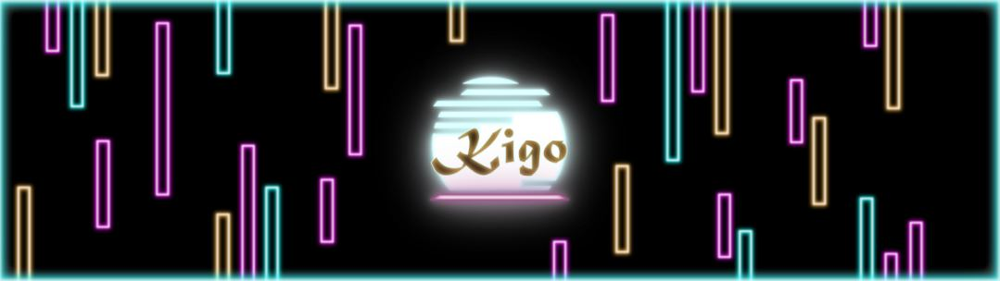
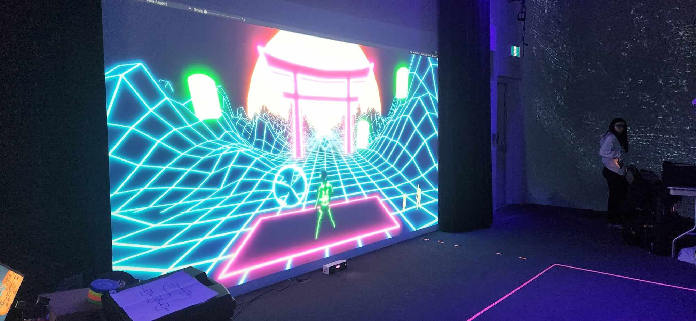

<h1 align=center>Crescentia 
Kigo</h1>
<h2 align=center>Une œuvre artistique développée par Érick Ouellette, William Rathier Mailly, Gabriel Clerval, Nicolas St-Martin et Antoine Dion en collaboration avec le Collège Montmorency
</h2>
 

Lieu de mise en exposition: <strong>Collège Montmorency</strong> 
Adresse : <strong>475 Bd de l'Avenir, Laval, QC H7N 5H9</strong> 
Présenté: <strong>18.03.2024 - 21.03.2024</strong>

  
 

<h2 align=center>Lien avec le thème Crescentia et description de l'oeuvre</h2>
<h3 align=center>
Kigo enrichit le projet Crescentia en introduisant une progression saisonnière et de difficulté. Chaque niveau du jeu correspond à une saison, avec des décors qui évoluent en conséquence. Cette approche dynamique donne vie à l'expérience de jeu, où chaque saison représente une montée en difficulté.</h3>

 <h3 align=center> L'installation en cours</h3>
 L'exposition de ce projet temporaire est déjà bien avancée, tous les composants nécessaires tels que le projecteur, les haut-parleurs, la Kinect et un ordinateur sont en place. Cependant, l'équipe est confrontée à un défi de taille en matière de codage. En effet, un problème persiste : lorsqu'un joueur avance physiquement, le personnage à l'écran recule, ce qui va à l'encontre de l'effet désiré. Ce problème doit être résolu pour que l'expérience fonctionne comme prévu.
   
 
| Allure projet | Délimitation | 
| :---: | :---: | 
| </h4> | </h4> |
<h1 align=center>
</h4>
</h1>

<h3 align=center>Schéma de l'installation  

</h3>
 Pour pouvoir réaliser cette installation il va falloir :  

- 1 Console de sons
- 1 Carte de sons
- 2 Haut-parleurs Genelec 8010APM
- 4 Câbles XLR (M->F) (Longueur minimale estimée entre 4-6 mètres)
- 1 Projecteur
- 1 Kinect V2
- 1 sytème d'acrochage pour le projecteur
- 2 Cordon IEC (pour alimenter les haut-parleurs)
- 2 Multiprise
- 2 Extensions de fils électrique (Longueur minimale estimée entre 6-8 mètres)
- 1 Câble d’alimentation pour ordinateur
- 1 Câble d’alimentation pour console de son
- 2 Fils Ethernet (longueur minimale estimée entre 4-8 mètres)
- 1 HDMI Extender
- 2 Câbles HDMI
- Câble displayPort
- 1 Chariot Ordinateur
- Tapis de protection
- 3 Safety en métal
- 1 Powercon
- 1 Magic Arm
- Kinect studio
- Unity
- Touch designer (Si Unity ne marche pas)
- Blender ou Maya
- OBS Studio
- Reaper
- Grand Studio
- Captation vidéo
- Projection vidéo sur un mur
- Installation et usage de hauts-paleurs
- Une table
- Un trépied pouvant supporter la kinect

<h3 align=center>Expérience vécue</h3>
<h4>Avant :</h4>En découvrant "Kigo", j'ai immédiatement été séduite par son concept. Le fait de devoir bouger tout le corps et de rester concentrée pour atteindre un score à battre a suscité mon intérêt. De plus, l'ajout de niveaux de difficulté croissante qui apporte un aspect compétitif m'a vraiment plu. Les couleurs néons vives ont également captivé mon attention dès le départ. Je pense que ce projet va être mon préférer. 
<h4>Après :</h4>Effectivement, "Kigo" est mon choix favori sans aucun doute. Ce jeu m'a procuré un plaisir indéniable grâce à sa fluidité et à sa jouabilité impeccable. De plus, il a favorisé de nombreuses interactions entre les participants, ce qui a enrichi l'expérience globale. En résumé, "Kigo" a su captiver mon intérêt et me divertir de manière exceptionnelle. 

<h3 align=center>Aspects que je ferais autrement</h3>
La seule modification que j'apporterais serait l'esthétique de l'interface. Bien qu'elle soit fonctionnelle et bien conçue, elle ne correspond pas tout à fait à mes préférences esthétiques. J'aimerais voir une interface qui reflète davantage mon style personnel ou qui soit plus en accord avec mes goûts visuels.

<h3 align=center>Ce qui m'a plu</h3>
J'ai été particulièrement attiré par ce projet, malgré son utilisation relativement modeste de matériel. Ce qui l'a rendu si captivant, c'est son potentiel à encourager l'interaction sociale. Chaque personne était encouragée à participer activement, car tout le monde cherchait à surpasser le meilleur score établi. Cette compétition amicale a créé une atmosphère dynamique où les participants se sont rassemblés pour collaborer, rivaliser et partager des moments de plaisir ensemble. C'était une expérience immersive qui a véritablement renforcé les liens entre les participants.

<h3 align=center>3 cours du programme incontournables pour ce projet</h3>

- Objets interactifs
- Réalité mixte
- Animation 3D

<h3 align=center>Technique ou composante technologique que je ne connaissais pas</h3>
Je n'avais aucune connaissance préalable sur ce qu'était un Kinect avant que l'équipe du projet ne m'explique son fonctionnement. Ils m'ont fait comprendre que c'est un dispositif qui permet de contrôler une interface sans recourir à une manette, en captant les mouvements du corps.

<strong>
Les informations présentées proviennent des créateurs de l'œuvre ainsi que de leurs ressources accessibles sur GitHub, ou bien de mes propres observations personnelles.
</strong>
 
 

Pour consulter plus de détails, veuillez cliquer sur ce lien :  
(https://tim-montmorency.com/2024/projets/Kigo/docs/web/index.html) 
