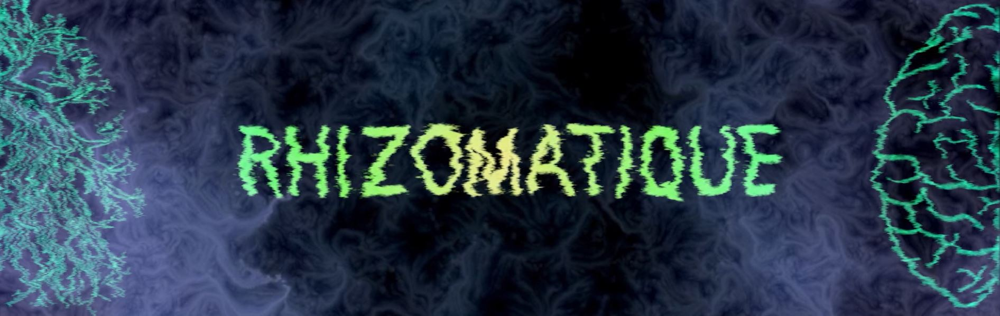
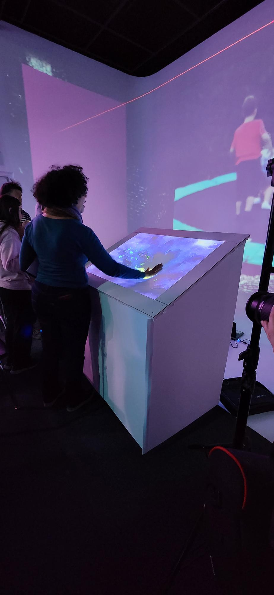
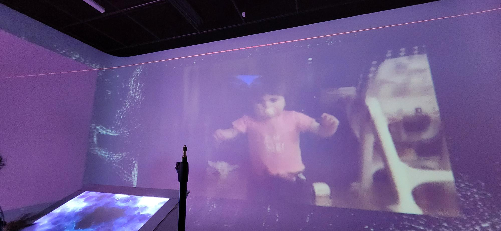
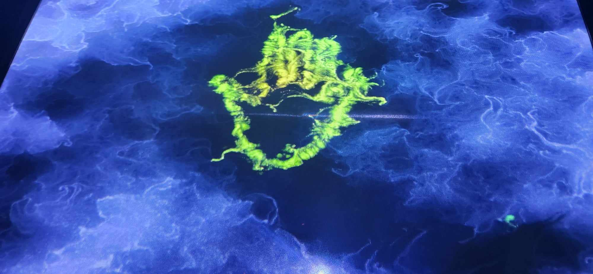

<h1 align=center>
Rhizomatique</h1>
<h3 align=center>Une œuvre artistique développée par Jolyanne Desjardins, MaÏka Désy, Laurie Houde et Felix Testa Radovanovic en collaboration avec le Collège Montmorency</h3>

 
<h2 align=center>Lien avec le thème Crescentia</h2>
<h3 align=center>
  Rhizomatique établit une connexion avec le projet Crescentia en offrant une expérience où l'environnement visuel évolue en fonction des gestes de l'utilisateur sur la toile. Cette interaction dynamique crée un lien entre l'utilisateur et l'environnement numérique, où les souvenirs deviennent plus clairs à mesure que l'utilisateur interagit davantage avec la toile.
</h3>
 

<h3 align=center> L'installation en cours</h3>
L'installation est déjà captivante et semble presque achevée, à l'exception des finitions qui restent à effectuer. Cela a ouvert la voie à des modifications supplémentaires, comme l'ajout de la "main verte", qui incite les spectateurs à interagir avec l'installation. Cette initiative a enrichi l'expérience en encourageant une participation active du public, créant ainsi une dimension interactive et engageante. Ces ajustements bonus ont non seulement amélioré l'esthétique globale, mais ont également ajouté une couche d'interactivité qui renforce l'impact de l'installation sur le public.
<h3 align=center>Essaie   

  </h3>
<h3 align=center>Allure  

  </h3>
<h3 align=center>Main  
  
</h3>

<h3 align=center>Schéma de l'installation  

</h3>
 Pour pouvoir réaliser cette installation il va falloir :  

- Toile de spandex (30" x 40")
- Cyclorama
- Construction en bois pour tenir la toile
- 4 haut-parleurs actifs de 4"
- 5 fils XLR 3 conducteurs de 15'
- powercon
- 4 systèmes d'acrochage
- 2 kinects
- 3 cables HTMI
- 1 lumières LED RGBAW DMX
- 2 fils XLR 3 conducteurs de 20'
- powercon
- 2 cordons IEC (pour l'alimentation des haut-parleurs)
- 2 extention
- 4 cables ethernet
- 3 received et transmited
- 1 ordinateurs portables
- TouchDesigner
- QlC+
- MadMapper
- VCV Rack 2
- DaVinci Resolve

<h3 align=center>Ressenti</h3>

Dès que j'ai découvert l'installation "Rhizomatique", j'ai immédiatement ressenti l'envie de placer ma main sur la toile. Cependant, je suis quelque peu sceptique quant à la capacité de l'installation à susciter une émotion réelle en moi, étant donné l'apparente absence de lien entre les différents souvenirs présentés. Cette fragmentation semble ne pas retenir mon attention, car elle ne crée pas un récit cohérent qui pourrait m'engager émotionnellement.

<strong>
Les informations présentées proviennent des créateurs de l'œuvre ainsi que de leurs ressources accessibles sur GitHub, ou bien de mes propres observations personnelles.
</strong>
 
 

Pour consulter plus de détails, veuillez cliquer sur ce lien : 
(https://tim-montmorency.com/2024/projets/Rhizomatique/docs/web/index.html) 
