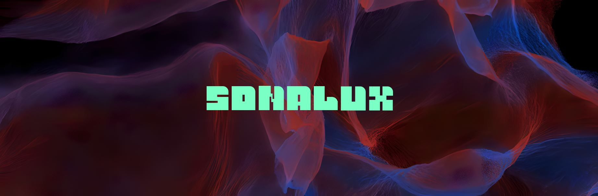

<h1 align=center>
Sonalux</h1>
<h2 align=center>Une œuvre artistique développée par Antoine Haddad, Camélie Laprise, Ghita Alaoui et Vincent Desjardins en collaboration avec le Collège Montmorency
</h2>
  

<h2 align=center>Lien avec le thème Crescentia</h2>
<h3 align=center>
  Solanux crée un lien avec le projet Crescentia en proposant une expérience où l'environnement visuel et sonore se transforme de manière organique, réagissant aux mouvements et gestes des utilisateurs. Cette interaction directe permet aux participants de modeler activement leur expérience, fusionnant ainsi leur présence physique avec l'univers numérique de Crescentia.
</h3>
 

Sonalux_boutons_20240220.png
Sonalux_installation_20240220.png
Sonalux_interface_programmation_20240220.png
| Allure projet | Délimitation | 
| :---: | :---: | 
| </h4> | </h4> |

<h4 align=center>Installation  
</h4>
 
<h3 align=center> L'installation en cours</h3>
<h3 align=center>Essaie   

  </h3>
<h3 align=center>Allure  

  </h3>
<h3 align=center>Main  
  
</h3>

<h3 align=center>Schéma de l'installation  

</h3>

<h3 align=center>Expérience vécue</h3>

Dès que j'ai découvert l'installation "Rhizomatique", j'ai immédiatement ressenti le besoin de poser ma main sur la toile, dont la texture douce m'a agréablement surprise. J'ai été particulièrement séduite par la nécessité de bouger délicatement ma main pour dévoiler des souvenirs sans lien apparent. Cette approche m'a permis de m'immerger dans une série de beaux moments, me laissant explorer une atmosphère immersive dépourvue d'une narration linéaire.

<h3 align=center>3 cours du programme incontournables pour ce projet</h3>

- Objets interactifs
- Réalité mixte
- Animation 3D

<h3 align=center>Technique ou composante technologique que je ne connaissais pas</h3>
<h5 align=center>
En discutant avec l'équipe, j'ai réalisé qu'il était possible de diviser le Kinect en sections, comme ils l'ont fait pour leur projet, afin de diffuser les images sur plusieurs écrans.</h5>

<strong>
Les informations présentées proviennent des créateurs de l'œuvre ainsi que de leurs ressources accessibles sur GitHub, ou bien de mes propres observations personnelles.
</strong>
 
 

Pour consulter plus de détails, veuillez cliquer sur ce lien :
(https://tim-montmorency.com/2024/projets/Sonalux/docs/web/index.html) 
