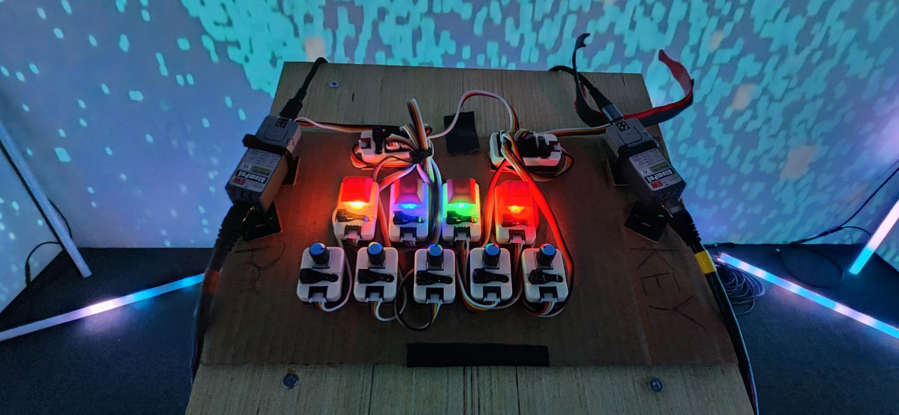
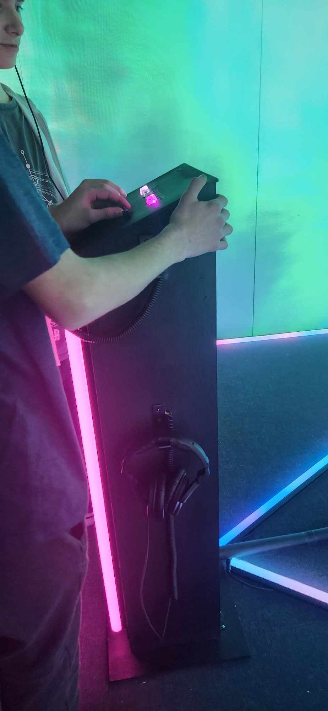
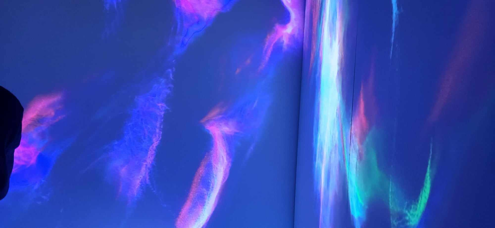
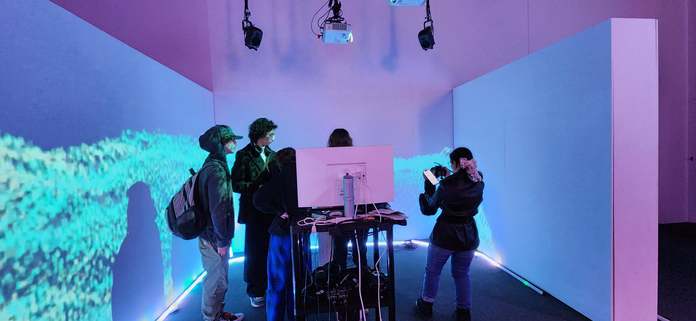

<h1 align=center>
Sonalux</h1>
<h2 align=center>Une œuvre artistique développée par Antoine Haddad, Camélie Laprise, Ghita Alaoui et Vincent Desjardins en collaboration avec le Collège Montmorency
</h2>
  

<h2 align=center>Lien avec le thème Crescentia</h2>
<h3 align=center>
  Solanux crée un lien avec le projet Crescentia en proposant une expérience où l'environnement visuel et sonore se transforme de manière organique, réagissant aux mouvements et gestes des utilisateurs. Cette interaction directe permet aux participants de modeler activement leur expérience, fusionnant ainsi leur présence physique avec l'univers numérique de Crescentia.
</h3>
 

<h3 align=center> L'installation en cours</h3>

| Boutons | Essaie | 
| :---: | :---: | 
| </h4> | </h4> |
| Allure projection | Installation | 
| </h4> | </h4> |

<h3 align=center>Schéma de l'installation  

</h3>
 Pour pouvoir réaliser cette installation il va falloir : 

- Table
- 

<h3 align=center>Expérience vécue</h3>

Dès que j'ai découvert l'installation "Sonalux", j'ai été attirée par son esthétique captivante, caractérisée par un choix subtil de couleurs et de mouvements. Son utilisation claire et intéressante à essayer m'a également impressionnée. En effet, en me perdant dans les vagues de couleurs, j'ai eu l'impression de devenir la maître de mon propre univers musical.

<strong>
Les informations présentées proviennent des créateurs de l'œuvre ainsi que de leurs ressources accessibles sur GitHub, ou bien de mes propres observations personnelles.
</strong>
 
 

Pour consulter plus de détails, veuillez cliquer sur ce lien :  
(https://tim-montmorency.com/2024/projets/Sonalux/docs/web/index.html) 
