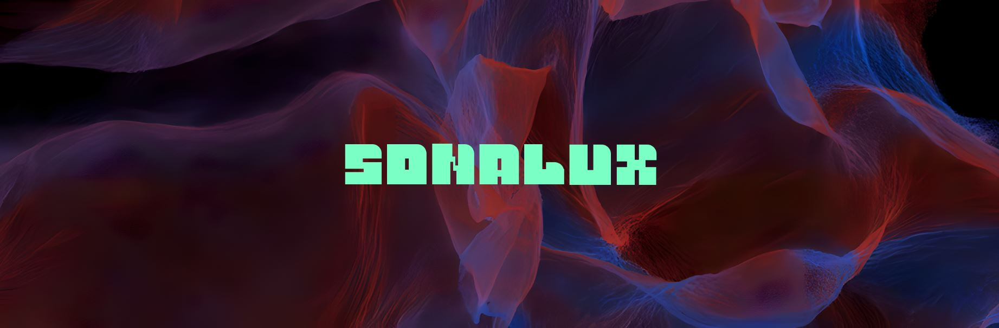
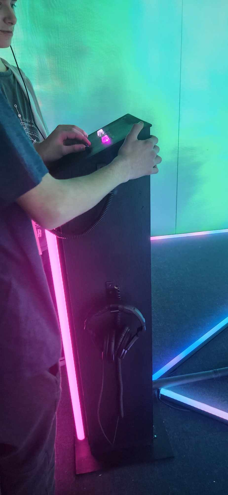
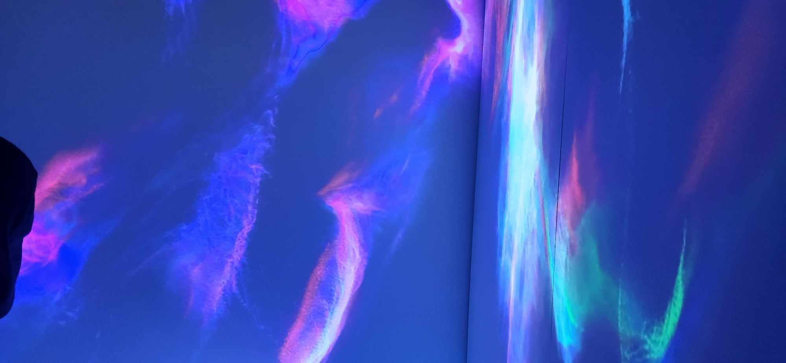

<h1 align=center>
Sonalux</h1>
<h2 align=center>Une œuvre artistique développée par Antoine Haddad, Camélie Laprise, Ghita Alaoui et Vincent Desjardins en collaboration avec le Collège Montmorency
</h2>
  

<h2 align=center>Lien avec le thème Crescentia</h2>
<h3 align=center>
  Solanux crée un lien avec le projet Crescentia en proposant une expérience où l'environnement visuel et sonore se transforme de manière organique, réagissant aux mouvements et gestes des utilisateurs. Cette interaction directe permet aux participants de modeler activement leur expérience, fusionnant ainsi leur présence physique avec l'univers numérique de Crescentia.
</h3>
 

<h3 align=center> L'installation en cours</h3>
L'installation a atteint un niveau où elle peut déjà offrir l'expérience recherchée par l'équipe. À ce stade, il semble que ce qui reste à faire concerne principalement les touches finales, comme dissimuler les câbles, installer les tubes LED et ajouter des supports pour les casques d'écoute. Une fois ces éléments finalisés, l'installation sera prête à offrir une expérience sans compromis, alliant fonctionnalité et esthétique de manière harmonieuse.
  

| Boutons | Essaie | 
| :---: | :---: | 
| </h4> | </h4> |
| Allure projection | Installation | 
| </h4> | </h4> |

<h3 align=center>Schéma de l'installation  

</h3>
 Pour pouvoir réaliser cette installation il va falloir :  

- 2 haut-parleurs actifs de 4"
- 4 fils XLR 3 conducteurs de 15' (M->F)
- Interface audio USB disposant 8 sorties et au moins 1 entrée
- 4 casques d'écouteurs
- Carte de son
- 3 projecteurs vidéo lentille grand angle 0.5
- 12 tubes DEL
- Spotlight
- 4 cordons IEC (pour l'alimentation des haut-parleurs)
- 2 extentions 3 fiches et 3 conducteurs
- 2 multiprises
- 4 fils cat6a de 15"
- Switch POE 5 ports
- 1 ordinateur portable
- 1 ordinateur sur chariot
- M5Stack
- 3 Atom Lite
- 3 Atom POE
- 5 Angle Unit
- 4 Key Unit
- 2 ToF Unit
- 2 PBHub
- 1 GroveHub
- 1 PaHub
- Podium
- 4 crochets
  

<h3 align=center>Ressenti</h3>
Dès que mes yeux se sont posé sur l'installation "Sonalux",  sa conception visuelle m'a instantanément séduite, et j'ai été impressionnée par son aspect à la fois clair et inspirant. Je m'attends à ressentir une sensation de douceur et de calme lors de cette expérience, notamment grâce aux magnifiques nuances de bleu et de vert qui évoquent une atmosphère apaisante et sereine.

<strong>
Les informations présentées proviennent des créateurs de l'œuvre ainsi que de leurs ressources accessibles sur GitHub, ou bien de mes propres observations personnelles.
</strong>
 
 

Pour consulter plus de détails, veuillez cliquer sur ce lien :  
(https://tim-montmorency.com/2024/projets/Sonalux/docs/web/index.html) 
