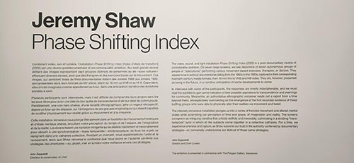

<h1 align=center>Description de l'oeuvre</h1>
L'exposition itinérante nommé "Phase Shifting Index" (2020) est une oeuvre à installation immersive qui mélange vidéo, son et lumière pour explorer la quête de transcendance et de communauté à travers différents groupes dans des activités de danse et de mouvement. Elle brouille la perception du temps et de l'espace, offrant une expérience immersive qui remet en question les conventions documentaires traditionnelles.
 
 

</img>
