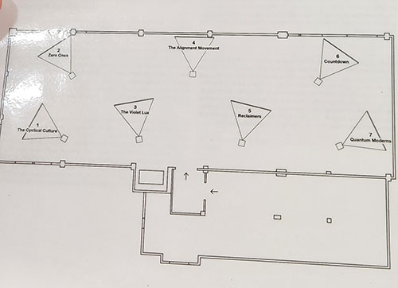
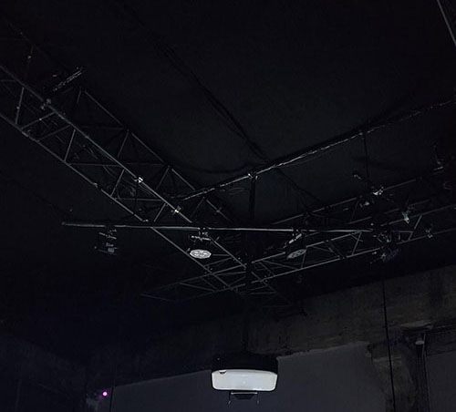
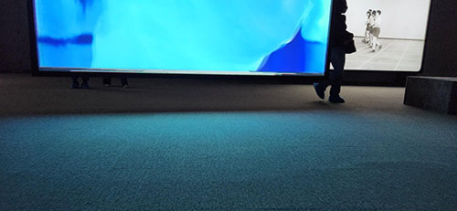
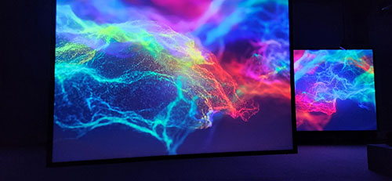
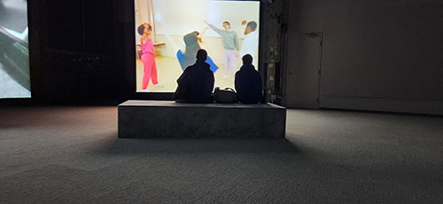
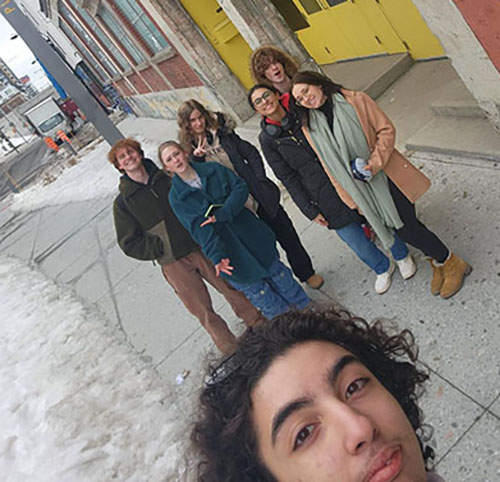

<h1 align=center>
Phase Shifting Index 
Jeremy Shaw
</h1>

Lieu de mise en exposition: Fonderie Darling 
Adresse : 745 Rue Ottawa, Montréal, QC H3C 1R8 
Présenté: 12.12.2023 - 25.02.2024

 
<h3>Mise en espace: </h3>
En rentrant dans la Fonderie Darling, nous sommes acceuillis directement par le bureau de la réception et en face des accroches manteaux. Suite à cela vers la droite un banc d'attente est placer proche de la pièce ou ce trouve l'illustration agrandi sur les murs. À partir de cette pièce, nous sommes dirigés vers des rideaux qui mènant à l'exposition qui dévoile la répétition de sept grands écrans identiques très bien distancés dans la pièce et centré plus vers l'entré qui son suivit de sept projecteurs et de sept plateformes qui son distancés de trois à quatre mètres. La salle était sombre et pourtant elle était quand même bien écléré par les grants écrans. Le son sortait directement de haut-parleurs proche des plateformes et visés vers le télespectateur pour accentuer l'immertion de l'expérience. Sans oublier qu'aucun fils ou prise électrique est montré ce qui donne l'impression que les écrans volant et que la pièces est très grandes et épurée. 
 
 

 
 
Composantes et techniques:
1. Plans de l'installation
2. Plans du matériels requis obligatoirement
3. Sept écrans
4. Sept projecteurs
5. Quatorze haut-parleurs de hautes qualités
6. Sept plateformes
7. Tapis
8. La tapisserie de l'illustration amplifié
9. Fils transparents asser forts pour soutenir les écrans

Éléments nécessaires à la mise en exposition:
1. Cache-fil
2. Câbles
3. Tapis
4. Plateformes
5. tapisserie
6. Écrans
7. Projecteurs
8. Hauts-parleurs
9. Isoler toute la salle pour ne plus qu'il y est de la pollution lumineuse

Expérience vécue: 
Le 2 février 2024, lors de ma visite de l'exposition de l'oeuvre "Phase Shifting Index" à la Fonderie Darling, la réceptionniste nous demande gentiment de retirer nos souliers ou de les proteger pour ne pas salir les tapis de la salle d'exposition ce qui m'a rendu heureuse puisque j'aime quand les oeuvres et les demandes des artistes sont respectées. Ensuite, une dame est venu pour nous expliquer bien en détails l'oeuvre qui allait nous être présentée et nous parler un peu plus des intentions de l'artise dans celle-ci. Suite au visionnement de l'oeuvre, je trouve que l'expérience de cette exposition a été intrigante et différente de mes attentes puisque je m'attendais a une approche plus similaire à celle des salles de cinéma avec une histoire spécifique à la quelle s'accrocher et donc finalement j'ai découvert une façon complaitement autre pour véhiculer des émotions par l'utilisation d'écrans.
 
 
Aspects que je ferais autrement:
Je ferais différament les salles de bains puisqu'ils était très proches de l'exposition et ne procuraient pas vraiment d'intimité puisqu'on entendais tirer la chasse d'eau à partir du couloir et je metterais un éclérage plus tamisé du côté de l'illustration amplifié sur les murs pour ajouter une certaine ambiance tamisé à la place d'un éclairage néon blanc.

Ce qui m'a plu:
J'ai beaucoup aimée l'installation des écrans qui était exécutée avec rigeur puisqu'il n'y avais pas de fils visible ce qui a crée une très belle finition et augmenté la qualité de l'exposition. J'ai aussi adoré le tapis qui était présent partout au sol et sur les plateformes dans la salle qui a procuré du confort et une expérience sensorielle agréable. Sans oublier que je me suis beaucoup amusé à faire la sortie en groupe.

Pour plus d'information cliquer ici: [Fonderie Darling](https://fonderiedarling.org)
