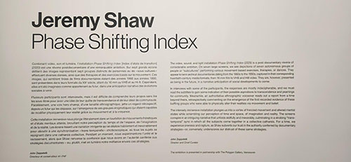

<h1 align="center">Phase Shifting Index</h1>
**<align="center">Jeremy Shaw>**
 Lieu de mise en exposition: Fonderie Darling 
Titre de l'oeuvre: Phase Shifting Index
Type d'exposition: Itinérante
Type d'installation: Immersive
Date de la visite: Le 2 février 2024
Année de réalisation: 2020
Description de l'oeuvre:
Mise en espace: 
Composantes et techniques:
Éléments nécessaires à la mise en exposition:
Expérience vécue: 
Ce qui m'a plu:
Aspects que je ferais autrement:

