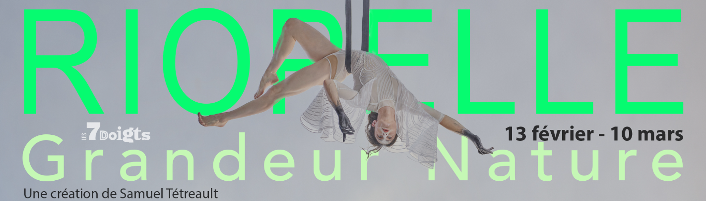
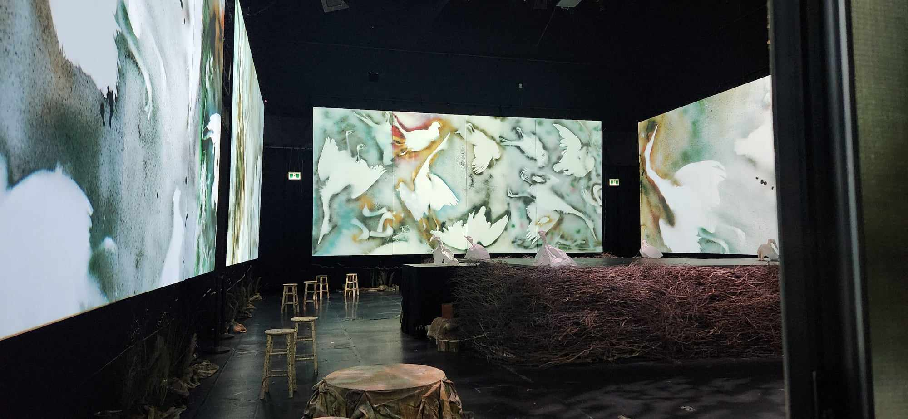
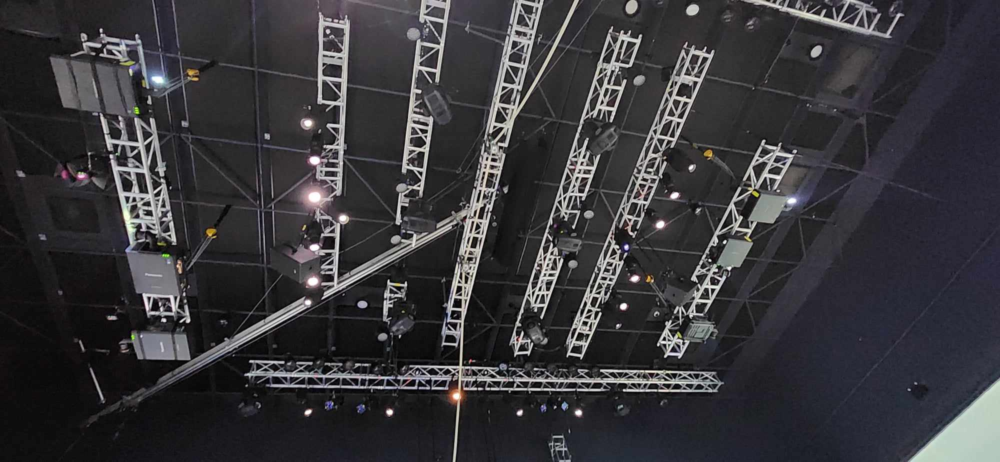
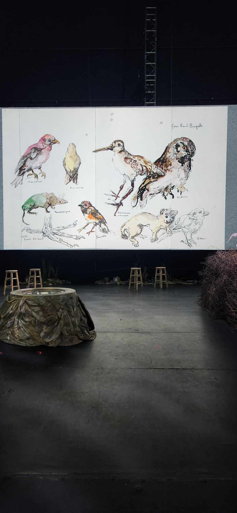
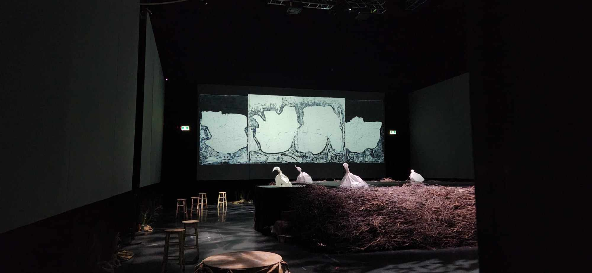
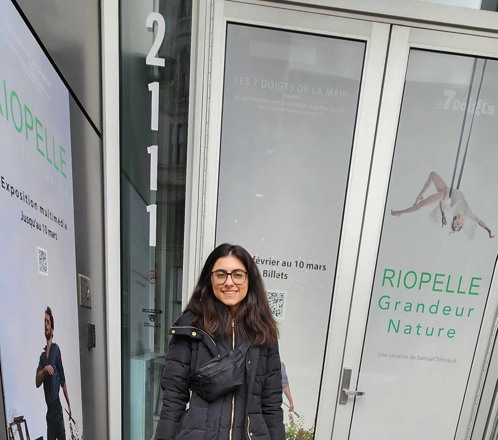

<h1 align=center>
RIOPELLE Grandeur Nature</h1>
<h2 align=center>Une œuvre artistique développée par Samuel Tétreault, en collaboration avec les 7 Doigts de la Main et la Fondation Jean Paul Riopelle
</h2>

Lieu de mise en exposition: <strong> Studio des 7 Doigts </strong> 
Adresse : <strong>2111 boulevard St-Laurent Montréal, H2X 2T5</strong> 
Durée : <strong>30 minutes</strong> 
Présenté: <strong>13.02.2024 - 10.03.2024</strong>

<h1 align=center>Description de l'oeuvre</h1>
  
<h3 align=center>L'exposition temporaire et immersive de Samuel Tétreault, "RIOPELLE Grandeur Nature", clôture de manière remarquable les célébrations du centenaire de Jean Paul Riopelle. En utilisant des technologies de pointe telles que la projection vidéo à 360° et la spatialisation sonore, elle transporte les visiteurs au cœur de l'œuvre de l'artiste et des paysages qui ont nourri son inspiration. De l'atelier de Riopelle aux paysages qui l'ont inspiré, en passant par ses œuvres les plus marquantes ainsi que celles moins connues, cette exposition offre une immersion totale dans l'univers créatif de Riopelle.</h3>
 

<h3 align=center>Mise en espace</h3>

À l'entrée, les visiteurs sont accueillis par un bureau de réception situé sur la gauche, où un code QR est disponible, fournissant diverses informations sur l'exposition, y compris le cartel. Cette zone s'intègre harmonieusement avec l'exposition principale, où sont présentées les toiles, sculptures et interactions artistiques. Un escalier conduit également au sous-sol, abritant la section consacrée aux Inuits et une salle de présentation vidéo sur la vie de Riopelle. Dans cette salle, six grands écrans sont disposés sur chaque mur rectangulaire, diffusant le son à travers des haut-parleurs positionnés au plafond. L'absence apparente de fils électriques crée une atmosphère aérée et spacieuse. Au centre de la salle se trouve un podium orné d'oiseaux en papier et de branches, évoquant un nid. Des brins d'herbe artificiels bordent la salle sous les écrans, ajoutant une touche finale à l'ambiance générale.
 
 

| Salle de projection | L'installation de la salle | 
| :---: | :---: | 
| </h4> | </h4> |
  
<h3 align=center>Composantes et techniques</h3>

- Plans de l'installation
- Plans du matériel requis obligatoirement
- Six écrans
- Six projecteurs
- Six grands haut-parleurs
- Six petits haut-parleurs
- Une grande plateforme
- Trois petites plateformes qui répliques des troncs d'arbre
- Quelques oiseaux en papier
- Plusieurs fausses plantes
- Plusieurs branches de bois
- Plusieurs chaises en bois
- Grands rideaux noirs
- Fils transparents assez forts pour soutenir les écrans
- Caissons de basses-fréquences

<h3 align=center>Éléments nécessaires à la mise en exposition</h3>

- Plans de l'installation
- Plans du matériel requis obligatoirement
- Six écrans
- Six projecteurs
- Six grands haut-parleurs
- Six petits haut-parleurs
- Une grande plateforme
- Trois petites plateformes qui répliques des troncs d'arbre
- Quelques oiseaux en papier
- Plusieurs fausses plantes
- Plusieurs branches de bois
- Plusieurs chaises en bois
- Grands rideaux noirs
- Fils transparents assez forts pour soutenir les écrans
- Caissons de basses-fréquences

<h3 align=center>Expérience vécue</h3>
<strong>Le 1er mars 2024</strong>, lors de ma visite de l'exposition "RIOPELLE Grandeur Nature" au Studio des 7 Doigts, j'ai eu du mal à trouver l'entrée en raison de sa petite taille et des affiches blanches peu discernables. Une fois franchit les portes, deux personnes m'ont accueilli et ont scanné mon billet. Cependant, par la suite, je me suis senti un peu désorienté car personne ne m'a guidé pour entamer ma visite et aucun cartel informatif n'était disponible. Malgré cette confusion, j'ai été captivé par la beauté des œuvres de Riopelle et l'ambiance chaleureuse créée par les lumières douces. Cela m'a conduit vers les escaliers où se trouvait l'une de mes œuvres préférées de l'exposition : le tableau représentant un dragon avec une ligne d'oiseaux suspendus au plafond. Ensuite, je me suis dirigé vers la salle vidéo qui explorait le parcours artistique de Riopelle. Diffusée en continu toutes les 30 minutes, elle se distinguait par son authenticité, évoquant les défis rencontrés au début de sa carrière artistique, tels que des problèmes monétaires, ainsi que de vrais croquis des débuts de sa carrière.
 
 
 
<h4 align=center>Croquis  
 </h4>

  
<h3 align=center>Aspects que je ferais autrement</h3>
Afin d'optimiser l'expérience des visiteurs, je suggérerais quelques réorganisations. Tout d'abord, je rendrais l'entrée plus visible et accueillante pour faciliter son repérage dès l'arrivée des visiteurs, attirant ainsi leur attention de manière plus efficace. Ensuite, j'assignerais du personnel spécialement dédié à l'accueil et à l'orientation des visiteurs tout au long de l'exposition, surtout compte tenu de sa répartition sur deux étages distincts. Cette assistance personnalisée garantirait aux visiteurs une exploration fluide et agréable, tout en leur offrant des réponses à leurs interrogations éventuelles. En complément, je mettrais en place un cartel général de l'œuvre au début de l'exposition. Ce cartel fournirait une vue d'ensemble de l'exposition, donnant des informations sur le thème, le contexte et les objectifs artistiques de l'ensemble de l'exposition. Cela permettrait aux visiteurs de mieux comprendre le contenu de l'exposition avant de débuter leur visite.

<h3 align=center>Ce qui m'a plu</h3>
Ce qui m'a particulièrement plu, c'est la diversité remarquable des œuvres présentées, allant des sculptures aux tableaux, en passant par les vidéos à des espaces interactifs. Cette variété a contribué à maintenir un intérêt constant et à éviter toute sensation de répétition. De plus, j'ai adoré l'aspect sophistiqué de l'exposition, qui ajoutait une touche d'élégance à l'ensemble.
 
 

| Salle | Allure sophistiquée | 
| :---: | :---: | 
| </h4> | </h4> |
| Sous-sol | Moi devant le Studio des 7 Doigts | 
| <h4 align=center></h4> |
</h4> |

<strong>
  Toutes les informations mentionnées ont été extraites du document accessible via le code QR à l'entrée, situé dans la section "Médias", ainsi que des fiches des œuvres, du site web de l'exposition, ou encore de mes propres observations personnelles.
</strong>
 
 
Pour obtenir plus d'informations, veuillez consulter les fiches des œuvres exposées disponibles dans la section "Médias", ou cliquez ici.
 
<h4 align=center>(https://tohu.ca/fr/programmation/riopelle-grandeur-nature)  
<h4 align=center>ou  
<h4 align=center>(https://7doigts.com/spectacles/creations/riopelle-grandeur-nature-spectacle)
 
