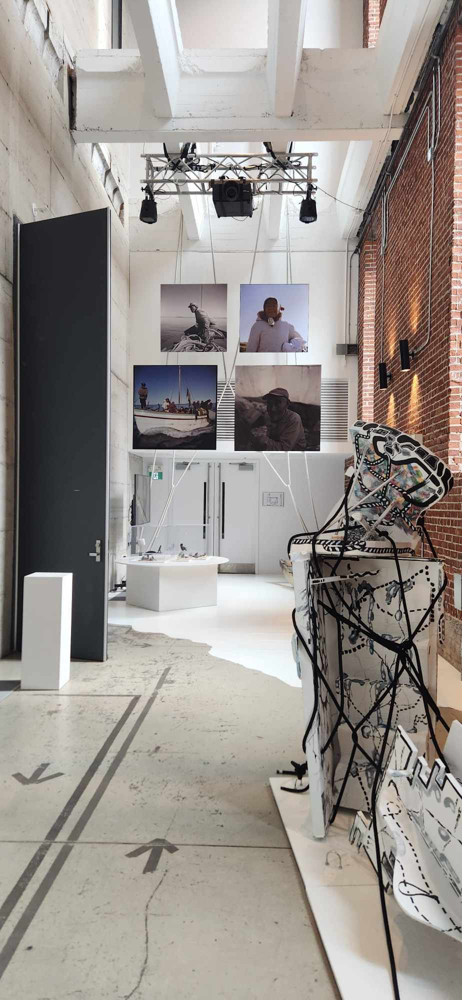

<h1 align=center>
RIOPELLE Grandeur Nature</h1>
<h2 align=center>Une œuvre artistique développée par Samuel Tétreault, en collaboration avec les 7 Doigts de la Main et la Fondation Jean Paul Riopelle
</h2>

Lieu de mise en exposition: <strong> Studio des 7 Doigts </strong> 
Adresse : <strong>2111 boulevard St-Laurent Montréal, H2X 2T5</strong> 
Durée : <strong>80 minutes</strong> 
Présenté: <strong>13.02.2024 - 10.03.2024</strong>

<h1 align=center>Description de l'oeuvre</h1>
  
<h3 align=center>L'exposition temporaire et immersive de Samuel Tétreault, "RIOPELLE Grandeur Nature", clôture de manière remarquable les célébrations du centenaire de Jean Paul Riopelle. En utilisant des technologies de pointe telles que la projection vidéo à 360° et la spatialisation sonore, elle transporte les visiteurs au cœur de l'œuvre de l'artiste et des paysages qui ont nourri son inspiration. De l'atelier de Riopelle aux paysages qui l'ont inspiré, en passant par ses œuvres les plus marquantes ainsi que celles moins connues, cette exposition offre une immersion totale dans l'univers créatif de Riopelle.</h3>
<h2 align=center>Cartel</h2>
 <h1 align=center></h1>
 
<h3 align=center>Mise en espace</h3>

À l'entrée, les visiteurs sont accueillis par un bureau de réception situé sur la gauche, où un code QR est disponible, fournissant diverses informations sur l'exposition, y compris le cartel. Cette zone s'intègre harmonieusement avec l'exposition principale, où sont présentées les toiles, sculptures et interactions artistiques. Un escalier conduit également au sous-sol, abritant la section consacrée aux Inuits et une salle de présentation vidéo sur la vie de Riopelle. Dans cette salle, six grands écrans sont disposés sur chaque mur rectangulaire, diffusant le son à travers des haut-parleurs positionnés au plafond. L'absence apparente de fils électriques crée une atmosphère aérée et spacieuse. Au centre de la salle se trouve un podium orné d'oiseaux en papier et de branches, évoquant un nid. Des brins d'herbe artificiels bordent la salle sous les écrans, ajoutant une touche finale à l'ambiance générale.
 
 

| Salle de projection | L'installation de la salle | 
| :---: | :---: | 
| </h4> | </h4> |
  
<h3 align=center>Composantes et techniques</h3>

- Plans de l'installation
- Plans du matériel requis obligatoirement
- Six écrans
- Six projecteurs
- Six grands haut-parleurs
- Six petits haut-parleurs
- Une grande plateforme
- Deux petites plateformes
- Quelques oiseaux en papier
- Plusieurs fausses plantes
- Plusieurs branches de bois
- Plusieurs chaises en bois
- Deux télévisions
- Plusieurs tableaux réalisés par Riopelle
- Plusieurs sculptures réalisées par Riopelle
- Quelques jeux interactifs
- Grands rideaux noirs
- Fils transparents assez forts pour soutenir les écrans

<h3 align=center>Éléments nécessaires à la mise en exposition</h3>

- Cache-fil
- Grands rideaux noirs
- Câbles
- Plateformes
- Oiseaux en papier
- Fausses plantes
- Branches en bois
- Jeux interactifs
- Tableaux
- Sculptures
- Télévisions
- Écrans
- Projecteurs
- Hauts-parleurs
- Isoler toute la salle pour ne plus qu'il y est de la pollution lumineuse
- Caissons de basses-fréquences

<h3 align=center>Expérience vécue</h3>
<strong>Le 1er mars 2024</strong>, lors de ma visite de l'exposition "RIOPELLE Grandeur Nature" au Studio des 7 Doigts, j'ai rencontré quelques difficultés pour trouver l'entrée. Une fois franchit les portes, deux personnes m'ont accueilli et ont scanné mon billet. Cependant, je me suis senti un peu perdu par la suite, car personne ne m'a guidé pour commencer ma visite. Malgré cette confusion, j'ai été impressionné par la beauté des tableaux de Riopelle. Cela m'a conduit vers les escaliers où se trouvait l'une de mes œuvres préférées de l'exposition : le tableau représentant un dragon avec une ligne d'oiseaux suspendus au plafond. Ensuite, je suis descendu pour regarder une vidéo qui décrivait le parcours artistique de Riopelle. Cette vidéo, qui jouait en boucle toutes les 30 minutes, s'est révélée très intéressante.
 
 
 

| Tableau du dragon | Ligne d'oiseaux | 
| :---: | :---: | 
| </h4> | </h4> |
<h4 align=center>Moi devant le Studio des 7 Doigts  
</h4>

  
<h3 align=center>Aspects que je ferais autrement</h3>
Je réorganiserais certains aspects pour améliorer l'expérience globale. Tout d'abord, je mettrais en évidence l'entrée de manière plus prononcée afin de faciliter la recherche de l'emplacement et d'attirer l'attention des visiteurs. Ensuite, je prévoirais du personnel dédié pour accueillir et orienter les visiteurs à travers l'exposition, en particulier étant donné sa répartition sur deux étages distincts. Cette assistance personnalisée permettrait aux visiteurs de profiter pleinement de chaque aspect de l'exposition et de répondre à leurs questions éventuelles tout au long de leur visite.

<h3 align=center>Ce qui m'a plu</h3>
Ce qui m'a particulièrement plu, c'est la diversité remarquable des œuvres présentées, allant des sculptures aux tableaux, en passant par les vidéos à des espaces interactifs. Cette variété a contribué à maintenir un intérêt constant et à éviter toute sensation de répétition. De plus, j'ai adoré l'aspect sophistiqué de l'exposition, qui ajoutait une touche d'élégance à l'ensemble. En ce qui concerne les œuvres spécifiques, j'ai été particulièrement captivé par les tableaux de Riopelle, qui dégageaient une belle ambiance.
 
 

| Sculpture | Tableau collectif | 
| :---: | :---: | 
| </h4> | </h4> |
<h4 align=center>Sous-sol
<h4 align=center></h4>
<h4 align=center>Atelier interactif  
</h4>
</h4>

<strong>
  Toutes les informations mentionnées ont été extraites du document accessible via le code QR à l'entrée, situé dans la section "Médias", ainsi que des fiches des œuvres, du site web de l'exposition, ou encore de mes propres observations personnelles.
</strong>
 
 
Pour obtenir plus d'informations, veuillez consulter les fiches des œuvres exposées disponibles dans la section "Médias", ou cliquez ici.
 
<h4 align=center>(https://tohu.ca/fr/programmation/riopelle-grandeur-nature)  
<h4 align=center>ou  
<h4 align=center>(https://7doigts.com/spectacles/creations/riopelle-grandeur-nature-spectacle)
 
